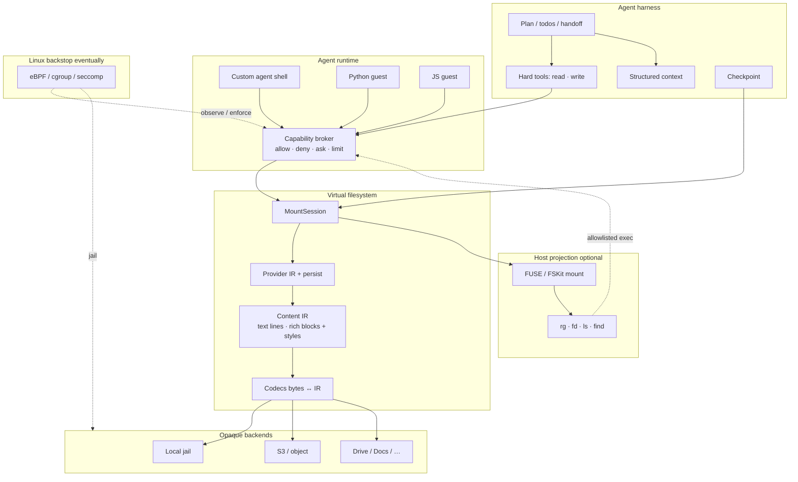
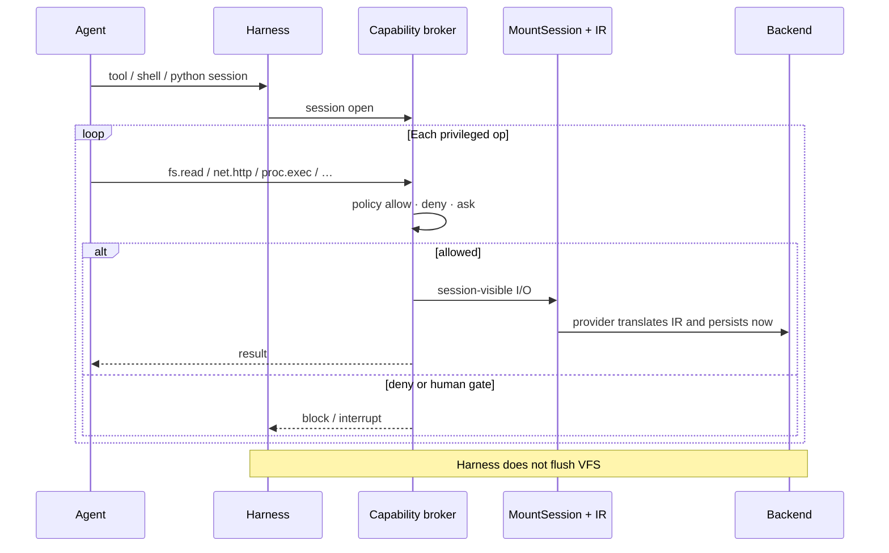

# Tacklr

[](https://github.com/Ryanaldo34/tacklr/actions/workflows/ci.yml)
[](https://github.com/Ryanaldo34/tacklr/blob/main/.testcoverage.yml)
[](https://pkg.go.dev/github.com/ryanaldo34/tacklr)
[](https://github.com/Ryanaldo34/tacklr/blob/main/go.mod)
[](https://github.com/Ryanaldo34/tacklr/blob/main/LICENSE)

**The enterprise agent operating system.** Tacklr is built for long-running research and operations workflows. We ship an **extensible Go SDK** for building agents, and plan a **CLI/TUI** that runs our default builtins. This is not another thin chat wrapper. It is a **secure execution environment**, a **company brain**, and an **efficient orchestrator**—one deterministic system instead of hope and prompts.

```bash
go get github.com/ryanaldo34/tacklr
```

---

## Documentation

| Doc | What it covers |
|-----|----------------|
| [docs/knowledge.md](docs/knowledge.md) | **Canonical** knowledge system: Engrams, search, graph, tools |
| [docs/vfs.md](docs/vfs.md) | Mounts, content IR, provider persist, lifecycle |
| [pkg.go.dev/tacklr](https://pkg.go.dev/github.com/ryanaldo34/tacklr) | Harness, tools, types |
| [pkg.go.dev/vfs](https://pkg.go.dev/github.com/ryanaldo34/tacklr/vfs) | Virtual filesystem API |
| [pkg.go.dev/brain](https://pkg.go.dev/github.com/ryanaldo34/tacklr/brain) | Knowledge engine API |
| [AGENTS.md](AGENTS.md) | Project goals and coding standards |
| This README | Why we exist, how the OS fits, quick start, roadmap |

---

## Why Tacklr exists

AI agents may be the most revolutionary technology in history—but between non-determinism and naivety, they are a security nightmare. Letting them run wild off the leash has not gone well. Tacklr attacks those reliability and security risks head-on:

1. **Virtualization** — With our [virtual filesystem](docs/vfs.md) and execution environment, the agent only sees what it is given access to—nothing else on the host. Like OS memory virtualization: each process has its own space and no knowledge of other programs.
2. **System monitoring** — Gating only on the tool *name* is naive. What matters is what happens *inside* the tool. We monitor agent activity at a system level and surface configurable alerts and approvals as needed.
3. **Observability** — Watchdog and observability layers show what the agent does each turn. Reproducible state (planned to deepen) lets you step back, reassemble context before a wrong turn, and debug prompts, tools, and workflows.
4. **Efficient context management** — Work is structured around *Adaptive Case Management*: advanced planning cycles that adapt as needed. When a subtask or milestone completes, a **handoff** carries only the context still required for the goal—cutting tokens and stopping the “dumber over time” effect of a polluted window.
5. **Cloud-native** — Built for the cloud and compatible with existing cloud infrastructure and security tools out of the box.

---

## An agent operating system

A normal OS virtualizes CPU, memory, and devices and mediates syscalls. We do the same for agents: **virtualize the world they can see, and mediate every action they take.**

The model proposes. **Our runtime decides what is real, allowed, and durable.**

| OS idea | What we do |
|---------|------------|
| Process address space | **Session mounts** — only the virtual paths you attach |
| Filesystem | **[`vfs`](docs/vfs.md)** — local, S3, brain Engrams, later Drive/Docs behind one path API |
| File contents | **Content IR** — what the agent edits (lines + Markdown block outline when applicable; rich WYSIWYG later). Codecs turn that into storage bytes on persist |
| Syscalls | **Tools**, and later a **custom agent shell** and script guests, all through a **capability broker** |
| Kernel | **Eventually** Linux eBPF / cgroup / seccomp as the backstop when something tries to cheat |
| Save process image | **Checkpoints** — conversation, plan, interrupts, mounts |
| Shared knowledge | **Optional [brain](https://pkg.go.dev/github.com/ryanaldo34/tacklr/brain)** — query when you need it, not a static RAG dump rotting in context |

```text
  Model
    │
    ▼
  Harness          turns · plan · handoff · tools · checkpoints
    │
    ▼
  Agent world      VFS + IR · shell/scripts (roadmap) · brain
    │
    ▼
  Your product     workers, CLI, protocol adapters ([server](https://pkg.go.dev/github.com/ryanaldo34/tacklr/server))
```

---

## Determinism and security

Models will always be probabilistic. **The harness does not have to be.** We are not promising identical token streams. We are promising a **closed, mediated, replayable world**—so the agent cannot wander into host chaos and you can actually operate the thing.

### Determinism (where it matters)

| What goes wrong elsewhere | What we do |
|---------------------------|------------|
| Context turns into sludge | Plans, todos, **handoffs**—only carry what the next work needs ([AGENTS.md](AGENTS.md)) |
| Disk and “open buffer” disagree | Session-visible **IR**; the provider persists on **WriteDocument** ([docs/vfs.md](docs/vfs.md)) |
| Edits clobber each other silently | Content **`rev`** (hash)—stale write fails closed, re-read and retry |
| Crash mid-run, state evaporates | **Checkpoints** + [stores](https://pkg.go.dev/github.com/ryanaldo34/tacklr/stores) (memory or Postgres) |
| Tools side-effect into the void | Structured results, plan effects, stream events—you can see what happened |
| Knowledge goes stale in the window | **Brain** on demand; optional [vfsindex](https://pkg.go.dev/github.com/ryanaldo34/tacklr/vfsindex) to index mounts |

**Closed world · mediated ops · one IR · rev’d writes · checkpointed truth.**

### Security (not a system-prompt prayer)

| What goes wrong elsewhere | What we do |
|---------------------------|------------|
| Agent can see the whole machine | **Mount jail**—virtual paths only; secrets stay on host factories |
| “Allow the `run` tool?” and hope | **Mid-flight gates** on real ops (`fs`, `net`, `proc`)—capability broker on the roadmap; eBPF later on Linux |
| Unscoped bash | We will not make raw host bash the main path. Planned: **custom agent shell** + allowlisted binaries on a projected VFS |
| Scripts with god-mode imports | Planned **sandboxed Python/JS** that only get our runtime APIs |
| One accidental `rm -rf` | Opaque data is not mounted. Discovery shell can be read-only; hard deletes go through policy |
| Multi-tenant cloud mess | Session-scoped mounts and namespaces; kernel backstops when you run this as infrastructure |

Security is a **platform property**. If it only lives in the system prompt, you already lost.

---

## How the framework is shaped

| Piece | Job | Docs |
|-------|-----|------|
| **Inference** | Talk to the model, nothing else | [`inference`](https://pkg.go.dev/github.com/ryanaldo34/tacklr/inference) |
| **Harness** | Turn loop, tools, plan, context, save/load | [`tacklr`](https://pkg.go.dev/github.com/ryanaldo34/tacklr) |
| **VFS** | Mounts, IR, provider persist | [docs/vfs.md](docs/vfs.md) · [`vfs`](https://pkg.go.dev/github.com/ryanaldo34/tacklr/vfs) |
| **Store** | Checkpoints | [`stores`](https://pkg.go.dev/github.com/ryanaldo34/tacklr/stores) |
| **Brain** | Knowledge (optional) | [`brain`](https://pkg.go.dev/github.com/ryanaldo34/tacklr/brain) |
| **Server** | Multi-agent / protocols (optional) | [`server`](https://pkg.go.dev/github.com/ryanaldo34/tacklr/server) |

A **turn** is one prompt (or resume after interrupt) until done, error, cancel, or a deliberate wait for the user:

```text
create_plan → tools → complete_todo → handoff → next work
```

---

## Quick start

```go
package main

import (
	"context"
	"fmt"
	"net/http"
	"os"
	"time"

	"github.com/ryanaldo34/tacklr"
	"github.com/ryanaldo34/tacklr/inference"
	"github.com/ryanaldo34/tacklr/stores"
)

func main() {
	ctx := context.Background()

	model := inference.NewOpenAIInferenceStrategy(&http.Client{Timeout: 2 * time.Minute})
	model.WithURL(os.Getenv("OPENAI_BASE_URL")).
		WithApiKey(os.Getenv("OPENAI_API_KEY")).
		WithModel(os.Getenv("OPENAI_MODEL"))

	agent := tacklr.NewAgent(ctx, tacklr.AgentOptions{
		Config: tacklr.Config{
			MaxWindowSize: 8192,
			SystemPrompt:  "You are a concise assistant.",
		},
		Model: model,
		Store: stores.NewInMemoryStore(),
	})
	defer agent.Close()

	events, err := agent.Run(ctx, "Outline three steps to organize a weekly operations review.")
	if err != nil {
		panic(err)
	}
	for ev := range events {
		switch ev.Type {
		case tacklr.StreamEventMessage:
			fmt.Print(ev.Content)
		case tacklr.StreamEventError:
			fmt.Println("error:", ev.Error, ev.Content)
		case tacklr.StreamEventComplete:
			fmt.Println()
		}
	}
}
```

### Tools

Tools are ordinary Go functions. `HarnessRuntime` is for host state, progress, and interrupts—not for rewriting the plan store behind the harness’s back.

```go
type SearchArgs struct {
	Query string `json:"query" desc:"The search query"`
	Limit int    `json:"limit,omitempty" desc:"Max results"`
}

tool := tacklr.NewTool(tacklr.ToolConfig{
	Name:        "search_records",
	Description: "Search operational records.",
	Handler: func(ctx context.Context, args SearchArgs, rt tacklr.HarnessRuntime) (string, error) {
		return doSearch(ctx, args.Query, args.Limit)
	},
})
```

### Sessions

```go
agent := tacklr.NewAgent(ctx, opts)
agent, err := tacklr.NewAgentFromSession(ctx, sessionID, opts)
```

Checkpoints cover conversation, plan, tool/user state, and pending interrupts. In-memory for throwaway runs; Postgres when you need durability. VFS writes persist immediately (write-through IR); checkpoints store mount specs, not a dirty document cache.

### Host tools vs plan system

| | Your tools | Plan builtins |
|--|------------|----------------|
| API | `HarnessRuntime` | Internal session (not on host tools) |
| May | State, interrupts, progress | Plan document and todos |
| May not | Rewrite the plan store | — |

That boundary exists so product code cannot accidentally trash planning.

### VFS

Register backends, bootstrap mounts—[docs/vfs.md](docs/vfs.md). When VFS is wired, the harness injects file tools (`list`, `stat`, `read`, `write`, `mkdir`, `remove`, `run_command`) over **virtual paths only**. The agent never gets a host path or a bucket key. Live names/grep go through `run_command` (`fd` / `find` / `rg`). With Brain + VFS + search namespace, the harness registers **`brain.BrainFactory`**, mounts **`/engram`** (prefix, `IndexPolicy=none`) unless the host already provided a brain-profile mount, and injects **`index_file` / `unindex`** for **artifact** mounts only. Indexed recall is brain `search`. Engrams are Markdown files on the brain Provider; `save_*` writes those paths (or `Engine.Put` if no brain mount). Path-native **link / unlink / expand / find_links**. Artifact → brain still uses one **IndexPath** pipeline (hash skip). Brain-profile mounts are never remirrored as Document/Chunk artifacts.

---

## Capabilities you can wire in

- **Planning** — `create_plan`, `list_plan`, `edit_plan`, `complete_todo` with install and handoff effects  
- **Interrupts** — pause a tool, get structured user input, resume  
- **MCP** — external tool servers ([`mcp`](https://pkg.go.dev/github.com/ryanaldo34/tacklr/mcp))  
- **Skills** — `SKILL.md` catalogs ([`skills`](https://pkg.go.dev/github.com/ryanaldo34/tacklr/skills))  
- **Web** — search/fetch when Exa is configured  
- **VFS** — mounts + IR ([docs/vfs.md](docs/vfs.md)); optional artifact index via [`vfsindex`](https://pkg.go.dev/github.com/ryanaldo34/tacklr/vfsindex) (`index_file` / `unindex` / IndexPolicy when Brain + namespace too); live names/grep via `run_command`  
- **Brain** — knowledge system when you set `AgentOptions.Brain`; host `KindSpec`s appear as Engram Markdown files (`/engram/…` or host roots) via `brain.Provider`. Full guide: [docs/knowledge.md](docs/knowledge.md)  


### Knowledge (brain)

This is not “stuff the last N chunks into the prompt and pray.” The brain is a host-owned engine:

- **Engrams** — first-class objects as Markdown files on a brain VFS mount  
- **Artifacts** — live files on local/S3, optionally indexed as Document + Chunks  
- **Postgres** (or memory) as source of truth — objects, hybrid search, filters, soft-delete  
- **Optional graph** (Helix or in-memory) for entities and links — `ls` never lists edges  
- **Namespaces** for isolation; path-native `link` / `expand` / `find_links`  

Canonical write-up: [docs/knowledge.md](docs/knowledge.md). API: [`brain`](https://pkg.go.dev/github.com/ryanaldo34/tacklr/brain).

### Observability

Optional OpenTelemetry on turns, tools, and retrieval ([`telemetry`](https://pkg.go.dev/github.com/ryanaldo34/tacklr/telemetry)). Bring a collector or inject providers. Nothing configured → no-op. We are not going to force your observability stack.

---

## Packages

| Package | Role | Link |
|---------|------|------|
| `tacklr` | Harness, tools, plan loop, subagents | [pkg](https://pkg.go.dev/github.com/ryanaldo34/tacklr) |
| `vfs` | Virtual filesystem, mounts, content IR | [docs](docs/vfs.md) · [pkg](https://pkg.go.dev/github.com/ryanaldo34/tacklr/vfs) |
| `vfsindex` | Optional mount → brain ingest (VFS and brain stay independent) | [pkg](https://pkg.go.dev/github.com/ryanaldo34/tacklr/vfsindex) |
| `brain` | Knowledge engine | [docs](docs/knowledge.md) · [pkg](https://pkg.go.dev/github.com/ryanaldo34/tacklr/brain) |
| `brain/helixgraph` | Optional graph adapter | [pkg](https://pkg.go.dev/github.com/ryanaldo34/tacklr/brain/helixgraph) |
| `inference` | OpenAI-compatible model client | [pkg](https://pkg.go.dev/github.com/ryanaldo34/tacklr/inference) |
| `server` | Multi-agent registry and protocol adapters | [pkg](https://pkg.go.dev/github.com/ryanaldo34/tacklr/server) |
| `stores` | Session checkpoints | [pkg](https://pkg.go.dev/github.com/ryanaldo34/tacklr/stores) |
| `interrupt` | Pause/resume types | [pkg](https://pkg.go.dev/github.com/ryanaldo34/tacklr/interrupt) |
| `streaming` | Shared messages and events | [pkg](https://pkg.go.dev/github.com/ryanaldo34/tacklr/streaming) |
| `mcp` | MCP config types | [pkg](https://pkg.go.dev/github.com/ryanaldo34/tacklr/mcp) |
| `skills` | Skill loading | [pkg](https://pkg.go.dev/github.com/ryanaldo34/tacklr/skills) |
| `telemetry` | OTEL helpers | [pkg](https://pkg.go.dev/github.com/ryanaldo34/tacklr/telemetry) |

---

## Roadmap: finishing the agent OS

We already have the harness, VFS, IR, brain hooks, and checkpoints. Next we close the loop on **execution**: FUSE (or projection), a **custom agent shell**, sandboxed **Python/JS**, a **capability broker** (approve what happens *during* a tool call), and eventually **eBPF** on Linux so the kernel agrees with the runtime.

### Feature status

| Area | Status | Notes |
|------|--------|--------|
| Planning + handoffs (ACM) | **Shipped** | Plans, todos, context rebuild on complete |
| Checkpoints / stores | **Shipped** | Conversation, plan, interrupts |
| Inference strategy | **Shipped** | OpenAI-compatible streams |
| Brain | **Shipped** | Optional; tools only when wired |
| VFS mounts (local, S3) | **Shipped** | [docs/vfs.md](docs/vfs.md) |
| Content IR (text) | **Shipped** | Provider translates IR and persists immediately |
| Content `rev` + file tools | **Shipped** | When VFS is set |
| Progressive line windows | **Shipped** | Large text without always full materialize |
| Structured Markdown / `block_id` | **Shipped** | Projected heading blocks; outline + block replace; index props |
| Mount → brain (`vfsindex`) | **Shipped** | Optional bridge; MD by blocks, other text by lines; async reindex later |
| Unified `read` / `replace` for all media | **Planned** | One edit surface; codecs do the rest |
| Rich document IR (WYSIWYG) | **Planned** | Word/Docs codecs → same Block schema + style metadata |
| FUSE projection | **Shipped** | `MountSession.FuseMount` — `rg` / `fd` / `ls` on the session tree |
| Custom agent shell | **Planned** | Our shell, VFS-backed—not raw host bash as the main path |
| Sandboxed Python / JS | **Planned** | Guests with our APIs only |
| Capability broker | **Planned** | Mid-flight allow / deny / ask |
| Linux eBPF / cgroup | **Eventually** | Backstop when something tries to leave the box |
| Materialize tree (no FUSE) | **Eventually** | Same idea without kernel FS glue |

**testserver** bootstraps virtual `Point: /work` with `LocalFactory.Base` as the host jail so you can poke mounts and file tools end-to-end.

### Target architecture



### What happens *during* a tool call



### Agent-facing surface (where we are going)

| Job | How |
|-----|-----|
| Discover / search | Restricted shell and/or `rg`·`fd` on FUSE; optional `list` / `stat` |
| Read (+ `rev`) | One **`read`**—lines or rich doc IR |
| Edit | **`replace`** / **`write`** with `rev` (plain and WYSIWYG) |
| Tree ops | Shell under policy, or thin tools if you refuse shell |
| Scripts / scrape | Sandboxed **python** / **js** with our APIs only |
| Knowledge | Brain tools when you attach an engine |

Mounts and IR in depth: [docs/vfs.md](docs/vfs.md).

---

## Develop

```bash
make test
make vet
```

How we work on this repo: [`AGENTS.md`](AGENTS.md).

---

## License

See [LICENSE](LICENSE).
