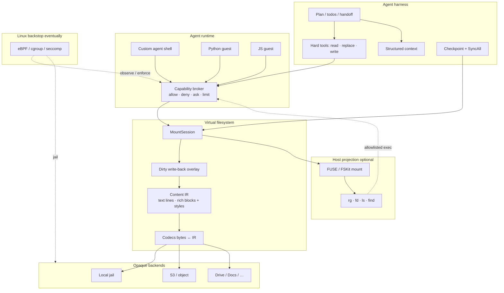
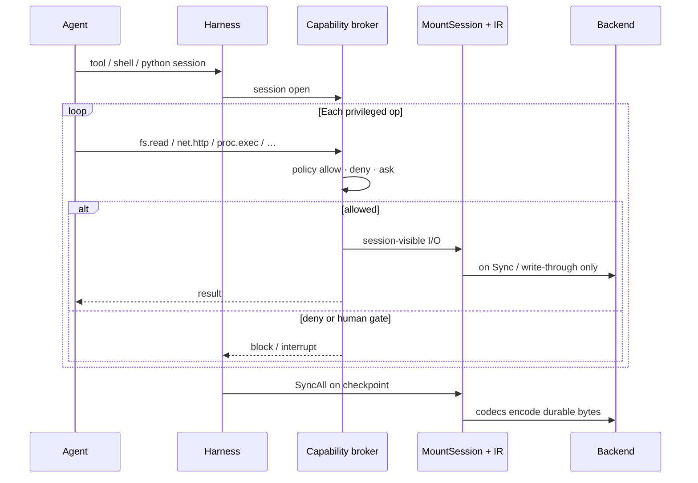

# Tacklr

[](https://github.com/Ryanaldo34/tacklr/actions/workflows/ci.yml)
[](https://github.com/Ryanaldo34/tacklr/blob/main/.testcoverage.yml)
[](https://pkg.go.dev/github.com/ryanaldo34/tacklr)
[](https://github.com/Ryanaldo34/tacklr/blob/main/go.mod)
[](https://github.com/Ryanaldo34/tacklr/blob/main/LICENSE)

**The Enterprise Agent Operating System** - Tacklr is a feature-complete agent operating system built for long-running research workflows. Tacklr will ship dually as a CLI/TUI application (planned) which runs all of our default built-ins and as an extensible SDK for building your own agents. Tacklr is more than just an *everyday agent harness*, it is a secure execution environment, company brain, and efficient orchestrator combined into a single, deterministic system.

## Getting Started

Install the SDK
```bash
go get github.com/ryanaldo34/tacklr
```

---

## Why Tacklr exists

AI agents are quite possibly the most revolutionary technology in human history, but between their non-determinism and general naiveness, they are a security nightmare. Letting AI agents run wild off the leash has proven to not be a great idea! Tacklr aims to solve these severe reliability & security risks with a few solutions:

1. Virtualization: Thanks to our virtual filesystem and execution environment, the agent only sees what it is given access to and nothing else on the host. If you are familiar with operating systems, this is much like memory virtualization and each process having their own memory space with no knowledge of other running programs
2. System Monitoring: Gating a tool just based on the call of the tool is an insanely naive model for gating tool calls. Its what happens within the tool that actually matters. We monitor what the agent is doing through tools at a system level and will send configurable alerts and approvals as needed.
3. Observability: Our watchdog and observability layer gives you full access to what the agent is doing in their turns. Our eventual reproducible state will allow you to step back and reassemble context at any given point before the agent took wrong turn in its workflow, allowing you to debug prompts, tools, etc and determine where things were going wrong
4. Efficient Context Management: Tacklr will structure work around the *Adaptive Case Methodology*, encouraging the agent to work through advanced planning cycles and adapting its workflow as needed. When the agent completes a subtask or milestone, it will produce a "handoff" of compressed context to carry over only relevant pieces needed to complete remaining subtasks and reach its overarching goal. This effectively reduces token usage and guards against agents getting dumber over time with a bunch of irrelevant garbage in the context window.
5. Cloud Nativeness: Tacklr is built for the cloud and is compatible with your existing cloud infrastructure & security tools out of the box

---

## How the framework is shaped

```text
  Model (OpenAI-compatible inference strategy)
            │
            ▼
     ┌──────────────┐
     │   harness    │  turns · tools · plan · handoff · checkpoints
     │   (tacklr)   │
     └──────┬───────┘
            ▼  stream events
     ┌──────────────┐
     │  host layer  │  your product, workers, or protocol adapters
     └──────────────┘
```

| Piece | Role |
|-------|------|
| **Inference strategy** | Talks to the model only; parses the stream |
| **Harness** | Owns a turn: tools, plan builtins, context, save/load |
| **Store** | Persists checkpoints across process boundaries |
| **Brain (optional)** | Knowledge engine and related tools |
| **Registry (optional)** | Multi-agent hosting and protocol-facing wiring |

A **turn** is one prompt (or resume after interrupt) until completion, error, cancel, or a deliberate wait for the user. Planning follows a simple lifecycle:

```text
create_plan → execute with tools → complete_todo → handoff → next work
```

---

## Quick start

```go
package main

import (
	"context"
	"fmt"
	"net/http"
	"os"
	"time"

	"github.com/ryanaldo34/tacklr"
	"github.com/ryanaldo34/tacklr/inference"
	"github.com/ryanaldo34/tacklr/stores"
)

func main() {
	ctx := context.Background()

	model := inference.NewOpenAIInferenceStrategy(&http.Client{Timeout: 2 * time.Minute})
	model.WithURL(os.Getenv("OPENAI_BASE_URL")).
		WithApiKey(os.Getenv("OPENAI_API_KEY")).
		WithModel(os.Getenv("OPENAI_MODEL"))

	agent := tacklr.NewAgent(ctx, tacklr.AgentOptions{
		Config: tacklr.Config{
			MaxWindowSize: 8192,
			SystemPrompt:  "You are a concise assistant.",
		},
		Model: model,
		Store: stores.NewInMemoryStore(),
	})
	defer agent.Close()

	events, err := agent.Run(ctx, "Outline three steps to organize a weekly operations review.")
	if err != nil {
		panic(err)
	}
	for ev := range events {
		switch ev.Type {
		case tacklr.StreamEventMessage:
			fmt.Print(ev.Content)
		case tacklr.StreamEventError:
			fmt.Println("error:", ev.Error, ev.Content)
		case tacklr.StreamEventComplete:
			fmt.Println()
		}
	}
}
```

### Tools

Tools are ordinary Go functions. Optional `HarnessRuntime` supports host state, progress updates, and interrupts—not direct mutation of the plan store.

```go
type SearchArgs struct {
	Query string `json:"query" desc:"The search query"`
	Limit int    `json:"limit,omitempty" desc:"Max results"`
}

tool := tacklr.NewTool(tacklr.ToolConfig{
	Name:        "search_records",
	Description: "Search operational records.",
	Handler: func(ctx context.Context, args SearchArgs, rt tacklr.HarnessRuntime) (string, error) {
		return doSearch(ctx, args.Query, args.Limit)
	},
})
```

### Sessions

```go
agent := tacklr.NewAgent(ctx, opts)
agent, err := tacklr.NewAgentFromSession(ctx, sessionID, opts)
```

Checkpoints include the conversation window, plan, tool and user state, and pending interrupts. Use an in-memory store for ephemeral runs or Postgres for durable ones.

### Host tools vs plan system

| | Your tools | Plan builtins |
|--|------------|----------------|
| API | `HarnessRuntime` | Internal session (not exposed on host tools) |
| May | State, interrupts, progress | Plan document and todos |
| May not | Rewrite the plan store | — |

That boundary keeps product logic from accidentally breaking planning.

---

## Capabilities you can wire in

- **Planning** — `create_plan`, `list_plan`, `edit_plan`, `complete_todo` with install and handoff effects  
- **Interrupts** — pause a tool for structured user input, then resume the turn  
- **MCP** — attach external tool servers via config  
- **Skills** — load `SKILL.md` catalogs (directories or object storage loaders)  
- **Web** — optional search/fetch when an Exa API key is configured  
- **Brain** — knowledge tools when `AgentOptions.Brain` is set  

### Knowledge (brain)

Not “paste the last N chunks into context.” The brain is a host-owned engine:

- **Postgres** as source of truth for objects, hybrid search, filters, soft-delete  
- **Optional graph backend** for entities and links  
- **Namespaces** for isolation  
- Tools such as `search`, `read`, `expand`, `find_objects`, and `find_links` when capabilities allow  

See package docs: [`brain`](https://pkg.go.dev/github.com/ryanaldo34/tacklr/brain).

### Observability

Optional OpenTelemetry on turns, tools, and retrieval. Bring your own collector or inject tracer/meter providers. With nothing configured, telemetry is a no-op.

---

## Packages

| Package | Role |
|---------|------|
| `tacklr` | Harness, tools, plan loop, subagents |
| `vfs` | Virtual filesystem, mounts, content IR ([docs](docs/vfs.md)) |
| `vfsindex` | Optional mount → brain ingest bridge (VFS and brain stay independent) |
| `brain` | Knowledge engine |
| `brain/helixgraph` | Optional graph adapter |
| `inference` | OpenAI-compatible model client |
| `server` | Multi-agent registry and protocol adapters |
| `stores` | Session checkpoints |
| `interrupt` | Pause/resume types |
| `streaming` | Shared messages and events |
| `mcp` | MCP config types |
| `skills` | Skill loading |
| `telemetry` | OTEL helpers |

---

## Roadmap: agent operating system

Tacklr’s long-term direction is an **agent OS**: a closed virtual world (filesystem + execution + policy) so agents stay efficient, scoped, and operable. Determinism here means **the world the agent can touch is explicit, mediated, and replayable**—not that the model always samples the same tokens.

**Principles we bake in:**

| Principle | Meaning |
|-----------|---------|
| **Closed world** | Only mounted virtual paths exist; backends stay opaque |
| **Single content truth** | Document IR is the agent-facing file; codecs own storage format on flush |
| **Mediated ops** | Shell, scripts, and tools act through policy—not ambient host authority |
| **Stable edits** | Content `rev` (hash) for optimistic concurrency on writes |
| **Few doors** | One edit surface across file types and mounts; discovery can use path tools or a restricted shell |
| **Checkpointed truth** | Sync IR, then persist session state—not mystery process memory |
| **Observe then enforce** | Gates on operations *during* a tool call, not only the tool name at the start |

### Feature status

| Area | Status | Notes |
|------|--------|--------|
| Planning + handoffs (ACM) | **Shipped** | Plans, todos, context rebuild on complete |
| Checkpoints / stores | **Shipped** | Conversation, plan, interrupts; Postgres or in-memory |
| Inference strategy | **Shipped** | OpenAI-compatible stream client |
| Brain (hybrid + graph hooks) | **Shipped** | Optional; tools only when wired |
| VFS mounts (local, S3) | **Shipped** | Session `MountSession`, host-owned factories |
| Content IR (text) | **Shipped** | `TextDocument`, line IR, write-back cache |
| Dirty session overlay | **Shipped** | `Stat` / `ReadDir` / `Open` / `ReadFile` / `Remove` see write-back before Sync |
| Content `rev` + edit tools | **Shipped** | `read_lines`, `replace_lines`, `replace_text`, `write`, tree tools when VFS is set |
| Progressive line windows | **Shipped** | `ReadLines` / `LineWindow` for large text without full IR when needed |
| Mount → brain index (`vfsindex`) | **Shipped** | Optional; SyncScheduler; async scheduler later |
| Unified `read` / `replace` for all media | **Planned** | One tool family; codecs for plain + rich docs |
| Rich document IR (WYSIWYG) | **Planned** | Blocks/runs + style metadata; Word and similar via codecs |
| FUSE projection of `MountSession` | **Planned** | Host `rg` / `fd` / `ls` on session-visible tree; macOS FSKit/macFUSE, Linux FUSE |
| Custom agent shell | **Planned** | Real shell process attached to runtime; VFS-backed builtins; no raw host bash as the main path |
| Sandboxed Python / JS | **Planned** | Guests with `tacklr.fs` / `tacklr.http` only—scraping and mini-programs under policy |
| Capability broker | **Planned** | Mid-flight allow / deny / ask on `fs` · `net` · `proc` · runtime ops |
| Linux eBPF / cgroup backstop | **Eventually** | Observe + enforce outside the runtime; correlate to tool sessions |
| Materialize tree (non-FUSE) | **Eventually** | Export session view for tools without FUSE where useful |

Local **testserver** mounts a local jail at `/tmp/tacklr` when VFS is enabled so agents can exercise mounts and file tools end-to-end.

### Target architecture

How the pieces fit when the agent OS is fully formed. Today’s harness already covers the top of the diagram (turns, plan, tools, VFS IR); lower layers are the roadmap above.



### Deterministic control loop (during a tool call)



### Intended agent-facing surface (target)

| Role | Mechanism |
|------|-----------|
| Discover paths / search text | Restricted shell and/or `rg`·`fd` on FUSE; optional `list` / `stat` |
| Read IR (+ `rev`) | Single **`read`** (lines or rich document JSON) |
| Edit IR | **`replace`** / **`write`** with `rev` (plain + WYSIWYG) |
| Tree mutate | Shell under policy, or thin tools if no shell |
| Scripts / scrape | Sandboxed **python** / **js** with runtime APIs only |
| Knowledge | Brain tools when an engine is attached |

Deep VFS detail: [docs/vfs.md](docs/vfs.md).

---

## Develop

```bash
make test
make vet
```

Contribution rules: [`AGENTS.md`](AGENTS.md).

---

## License

See [LICENSE](LICENSE).
