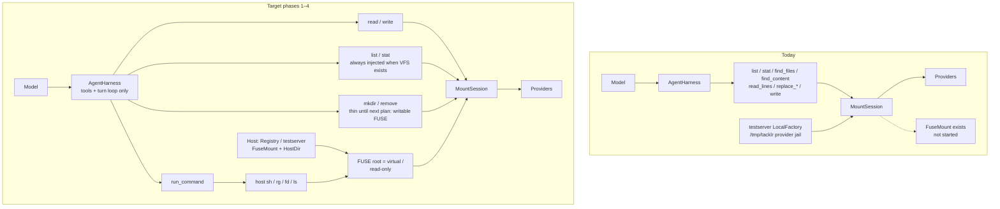
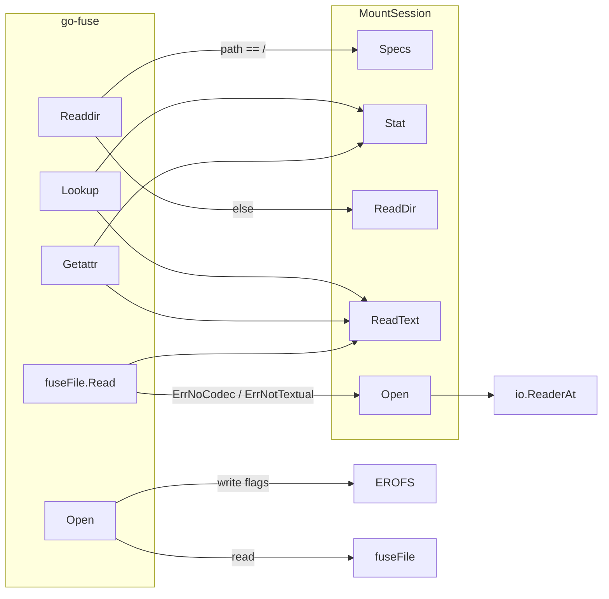
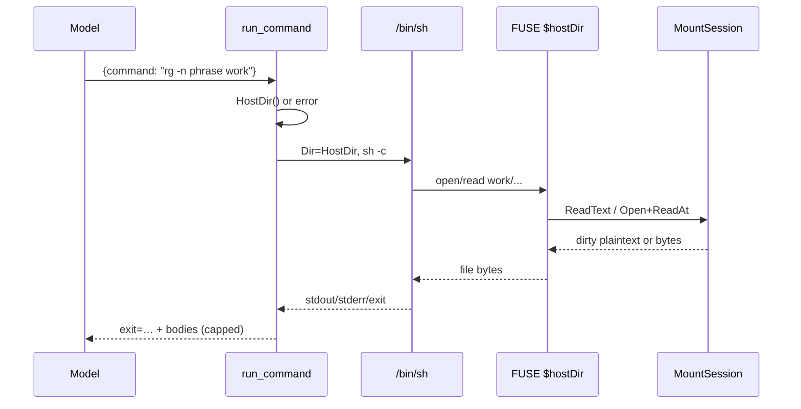

# FUSE as the VFS projection; bash via run_command; collapse file tools to read() and write()

| Field | Value |
|-------|--------|
| **Author** | Tacklr engineering |
| **Date** | 2026-08-13 |
| **Product** | Tacklr — opinionated Go agent harness SDK |
| **Repo** | `/Users/ryan/development/tacklr` |
| **Status** | Draft |
| **Depends on** | `vfs.MountSession`, `MountSession.FuseMount`, harness VFS tools, `server.Registry` |

---

## Overview

Tacklr already has a session-owned virtual filesystem (`vfs.MountSession`) and a read-only FUSE projection (`MountSession.FuseMount`). The projection is not started for live host sessions. Agents therefore discover and mutate the tree only through a large set of harness tools (`list`, `stat`, `mkdir`, `remove`, `find_files`, `find_content`, `read_lines`, `replace_lines`, `replace_text`, `write`). Those discovery tools exist because host `ls` / `rg` / `fd` cannot see the VFS.

This design makes FUSE the required host projection of any session that has a VFS. The FUSE root **is** virtual `/`. Host processes started with cwd (later: chroot) at the mount see the same tree the session APIs see, including dirty IR plaintext. The harness then grows one `run_command` tool that runs real host binaries against that tree. After live discovery works through bash, `find_files` and `find_content` go away; `list` and `stat` stay **always injected** when VFS exists (the degrade discovery *path* when there is no projection, not a conditional catalog). `read` and `write` become the edit surface (IR optional). A custom agent shell and escape prevention stay out of this train. **Writable FUSE is the next plan after this train** so `run_command` can `mkdir`/`rm`/`echo >`; thin `mkdir`/`remove` stay until then.

---

## Background & Motivation

### Current state

The VFS stack is already split correctly between packages:

| Layer | Location | Role today |
|-------|----------|------------|
| Session tree | `vfs.MountSession` in `vfs/session.go` | Mount table, path I/O, write-back IR cache |
| Kernel projection | `MountSession.FuseMount` in `vfs/fuse_node.go` | Read-only go-fuse tree; **explicit**; not started by the harness |
| Provider backends | `vfs/local.go`, `vfs/s3.go`, `brain` Provider | Bytes behind a mount point |
| Content IR | `vfs/document.go`, `vfs/document_session.go` | `ReadText` / `WriteDocument` / `ReadLines` |
| Harness tools | `tools_vfs.go`, `tools_vfsindex.go` | Agent-facing file and index tools |
| Hosts | `cmd/testserver/main.go`, `server/registry.go` | Create agents; do **not** call `FuseMount` |

`NewMountSession` (`vfs/session.go:84`) only binds a session id and a `BackendRegistry`. It does not mount FUSE. That is the correct constructor. The rejected design (auto-start via `flag.Lookup("test.v")`) is not present.

`injectBuiltinTools` (`agent_construct.go:176`) appends `newVFSTools(a.session.VFS)` when a mount session exists. It does not attach FUSE. `AgentHarness.Close` (`agent.go:731`) already calls `session.VFS.Close()`, which unmounts FUSE if one was started.

`cmd/testserver/main.go` registers `LocalFactory{ID: "local", Base: "/tmp/tacklr"}` and bootstraps `MountSpec{Point: "/tmp/tacklr", Profile: "local"}`. That is a **provider jail**, not a FUSE projection. The agent sees virtual `/tmp/tacklr/...`. The host path `/tmp/tacklr` is the backend root. They happen to share a string, which hides the identity problem.

`server.Registry.loadAgent` (`server/registry.go:483`) passes `FSRegistry` and `FSBootstrap` into `tacklr.NewAgent` / `NewAgentFromSession`. It never calls `FuseMount`.

The one kernel smoke test is `TestFuseMount_hostSeesDirtyText` (`vfs/fuse_test.go`). It mounts, writes dirty IR, and asserts `os.ReadFile` on the host tree returns the dirty plaintext. It skips when `/dev/fuse` and `/dev/macfuse*` are absent.

### Pain points

1. **Discovery is reimplemented in Go.** `find_files` walks with `Stat`/`ReadDir` and a 50/200 result budget. `find_content` searches the brain index, not live files. Neither is `rg` / `fd`.
2. **The model cannot use the host toolchain.** README already lists FUSE as shipped (`README.md` roadmap table). Live sessions do not start it, so `rg` over the session tree is fiction.
3. **Path confusion.** testserver's mount point `/tmp/tacklr` looks like a host path. After FUSE exists, host `$mnt/tmp/tacklr` vs agent `/tmp/tacklr` vs backend `/tmp/tacklr` are three different things that currently share a string.
4. **Too many file tools.** Nine VFS tools plus `find_content` compete in the model catalog. The intended long-term surface is `run_command` + `read` + `write`.
5. **Dirty IR is invisible to any future host command until FUSE is started.** `fuseFile.Read` already prefers `ReadText` so `rg` would see unsynced edits. Nothing starts the mount.

### Why now

Intentions 1–4 (start FUSE, path identity, byte identity, smoke) must be true before `run_command` is useful. Collapsing tools before bash can see the tree would remove discovery with no replacement.

---

## Goals & Non-Goals

### Goals

1. **FUSE is required when a session has a VFS and a FUSE device exists.** Hosts that own the process start it. Harness tools, `MountInfo`, `Specs`, and checkpoints never emit `HostDir`. The child of `run_command` can still discover the host cwd (`pwd`, `$PWD`) until a later jail — that leak is accepted, not filtered.
2. **Path identity.** FUSE root is virtual `/`. After cwd (later chroot) into the mount, `ls work` matches `MountSession.ReadDir(ctx, "/work")`. `ls /work` matches only after the later jail. No path-rewrite layer. Every `MountSpec.Point` in a FUSE session is a single path segment (`/work`, `/engram`).
3. **Byte identity.** `getattr` / `read` for textual files equal `ReadText` (dirty IR plaintext). Binaries use `Stat` + `io.ReaderAt`. `rg` sees unsynced `WriteDocument` edits.
4. **Smoke.** Mount, host `ls`/`cat`/`rg`, assert match with `ReadDir`/`ReadText`. Skip when the kernel has no FUSE device.
5. **`run_command`.** Real host processes, cwd = FUSE root. No custom shell. No escape wall in this plan. Registry/testserver inject it with `PermissionRequired: true`.
6. **Collapse the file catalog** after live discovery works: drop `find_files` and `find_content`; keep `list` and `stat` **always injected** whenever VFS exists (prefer `run_command` → `ls`/`stat` when FUSE is up; they are the discovery path when it is not); replace `read_lines` with `read`; fold `replace_lines` / `replace_text` / `write` into one `write`.
7. **Keep existing package boundaries.** No `vfs` ↔ `brain` import cycle. Harness does not own FUSE. Prefer stdlib. No new module except making `github.com/hanwen/go-fuse/v2` a **direct** require (it is already used; `go.mod` lists it as indirect).

### Non-goals (this plan)

| Item | Why deferred |
|------|----------------|
| Deny leaving the FUSE/cwd jail | Later, after FUSE + VFS intentions work |
| Capability broker, allowlists, eBPF | README "Eventually"; not this plan |
| Custom agent shell | First path is real host `ls`/`rg`/`fd` |
| Writable FUSE (`mkdir`/`rm`/`echo >`) | **Next plan after this PR train**, so bash can mutate the tree. This train keeps FUSE `EROFS` and thin `mkdir`/`remove` tools. |
| Duplicate POSIX layer on FUSE nodes | Nodes call session `Stat` / `ReadText` / `ReadDir` / `Open` |
| Auto `FuseMount` in `NewMountSession` | Rejected; constructor stays explicit |
| FUSE on `AgentHarness` | Harness owns LLM exposure and turn lifecycle only |
| Path rewrite (`/work` → `$mnt/work` in argv) | Breaks path identity; rejected |
| Materialize-tree fallback (copy to disk) | README "Eventually" |
| Changing IR codecs, `File` shape, or provider interfaces | `File` is already `Close`+`Stat`; comma-ok for I/O |
| Subagent / worker VFS and `run_command` | `workerOptsFromSpec` (`subagents.go`) omits `FSRegistry` / `MountSession`. Workers do not share the parent FUSE tree. Out of scope. |
| Windows host projection | `run_command` is `/bin/sh -c`; FUSE is Unix (`/dev/fuse`, `/dev/macfuse*`). No WinFsp / cmd.exe path in this plan. |

---

## Proposed Design

### Phases

```text
Phase 0  Pin FUSE TTLs; session Close lifetime; HostDir / FuseAvailable
Phase 1  Hosts start FuseMount for live VFS sessions; single-segment points
Phase 2  run_command (cwd = FUSE root; no jail; PermissionRequired true)
Phase 3  Drop find_files and find_content; list/stat stay always injected
Phase 4  Collapse read_lines → read; collapse replace_* + write → write
Next     Writable FUSE (next plan after this train) so mkdir/rm/echo > work in run_command
Later    Custom shell; jail / broker / eBPF; drop list/stat
```

Phase 0–1 are the load-bearing intentions. Later phases must not start if those intentions fail.

### Current vs target architecture



### Path and byte identity

```text
Virtual path          Agent tool / IR              Host after cwd into FUSE
/                     FUSE root                    $hostDir/
/work                 MountSpec.Point              $hostDir/work
/work/note.md         ReadText / WriteDocument     $hostDir/work/note.md

ReadText("/work/note.md").Text()  ==  os.ReadFile("$hostDir/work/note.md")
ReadDir(ctx, "/work")             ==  os.ReadDir("$hostDir/work")   (names + dir-ness)
```

There is no rewrite table. The kernel tree **is** the virtual tree. The agent continues to pass absolute virtual paths (`/work/note.md`) to `read` / `write`. Host commands see those paths as relative to FUSE root (`work/note.md`) until a later jail makes `/work` mean the virtual path (see Alternatives and residual risk).

**Single-segment mount points are required for FUSE.** `fuseNode.Readdir` at `/` emits one dirent per `Specs()` name after trimming `/`, and skips any name that contains `/` (`fuse_node.go:89-96`). `mountTable.resolveEntry` (`vfs/fs.go:99-108`) does not create intermediate virtual directories: `Stat("/tmp")` with a mount at `/tmp/tacklr` returns `ErrNotMounted`, so `Lookup("tmp")` fails and the FUSE root is empty.

`FuseMount` (and therefore Registry `loadAgent`) **fails** if any live spec’s `Point` is not exactly one segment after `/`. Intended shape: `/work` (artifacts) + `/engram` (brain; already single-segment). `/tmp/tacklr` and `/work/data` are rejected with a clear error. Durable checkpoints that still store `/tmp/tacklr` cannot start a projection until the host rematerializes with a single-segment point.

**testserver mount point.** Change `FSBootstrap` from `Point: "/tmp/tacklr"` to `Point: "/work"`. Keep `LocalFactory.Base = "/tmp/tacklr"` (or a temp dir). Backend bytes stay on disk; the agent and the FUSE tree both show `/work`. The current shared string `/tmp/tacklr` is a provider mount, not a projection, and it would fail the new FUSE constraint.

### FUSE op → session API

Existing mapping in `vfs/fuse_node.go`. Keep it. Do not add a POSIX adapter.



| FUSE op | Session call | Notes |
|---------|--------------|--------|
| `Lookup(name)` | `Stat` then, for files, `ReadText` to set size | Child `fuseNode.path` is the virtual path |
| `Readdir` at `/` | `Specs()` — one dirent per mount point (single-segment points only) | Matches current `fuse_node.go:89-96`. Multi-segment points are rejected at `FuseMount` (see path identity). |
| `Readdir` else | `ReadDir` | Dirty overlay already merged in `session.go:369` |
| `Getattr` | same as `stat()` helper | Text size = `len(ReadText().Text())` |
| `Open` | no session open yet | Write flags → `EROFS` (`fuse_node.go:124`) |
| `Read` | `ReadText` first; else `Open` + `ReaderAt` | Dirty IR visible to `cat`/`rg` |
| `Write` / `Create` / `Mkdir` / `Unlink` | not implemented | Kernel returns EROFS / ENOSYS |

**Required FuseMount option change (Phase 0).** Pin documented zero TTLs. `FuseMount` already passes a non-nil `fusefs.Options` (`fuse_node.go:34-36`). go-fuse applies the 1-second default only when `opts == nil`. Nil `EntryTimeout` / `AttrTimeout` pointers are not written onto replies, so the kernel already sees timeout 0 — `TestFuseMount_hostSeesDirtyText` reads dirty bytes immediately. Explicit zeros are still required: they document intent, set `NegativeTimeout`, and stay correct if a later change passes `nil` options.

Do not add `InodeNotify` in phase 0; pinned zero cache is enough and stays in one function. This is not a current 1s-cache bug.

```go
zero := time.Duration(0)
srv, err := fusefs.Mount(dir, &fuseNode{sess: m, path: "/"}, &fusefs.Options{
    MountOptions: gofuse.MountOptions{FsName: "tacklr", Name: "tacklr"},
    EntryTimeout:    &zero,
    AttrTimeout:     &zero,
    NegativeTimeout: &zero,
})
```

**Getattr cost.** Every `getattr` on a textual file may `ReadText` (up to `MaxReadFileBytes` = 32 MiB). `rg` stats every file. For phase 0–1 this is the correctness path; do not add a second size cache type. `Stat` already returns dirty size via `statDirty` (`session.go:215`). A later optimization may skip `ReadText` on getattr when `Stat` size is known to equal IR plaintext length. Not in the first PRs.

`fuseFile.Read` also calls `ReadText` per chunk. Acceptable for v1. Do not add an unexported read-ahead cache type unless a measured test fails.

The existing session IR cache (`vfs/cache.go`: `maxCacheEntries = 32`, `maxCacheBytes = 64 MiB`) is **not** a FUSE read-ahead cache. `ReadText` → `OpenDocument` → `cache.put` of a clean clone. `rg` over more than 32 files evicts those clean entries, so the next read decodes again. Dirty entries are protected; a large dirty tree can pin up to 64 MiB. Leave that interaction as-is in v1.

### Who starts FUSE (and who must not)

```mermaid
sequenceDiagram
  participant Host as Registry / testserver
  participant Harness as AgentHarness
  participant MS as MountSession
  participant Kernel as go-fuse

  Host->>Harness: NewAgent / NewAgentFromSession<br/>(FSRegistry, FSBootstrap or MountSession)
  Harness->>MS: NewMountSession (if nil) + Materialize
  Note over Harness: Harness does not call FuseMount
  Harness-->>Host: harness ready
  Host->>MS: FuseMount(hostDir)
  MS->>Kernel: fusefs.Mount(dir, fuseNode{path: "/"})
  Note over Host,MS: hostDir stays on MountSession (unexported field + HostDir accessor)
  Note over Harness: Harness tools never emit HostDir; child pwd can
```

Rules (already decided; restated for implementers):

1. `NewMountSession` does not mount. No `flag.Lookup`, no `testing.Testing()`, no env var in the constructor.
2. `AgentHarness` does not grow a `FuseMount` method or an `attachFUSE` hook.
3. The process owner calls `FuseMount` after the session tree exists.
4. `MountSession.Close` unmounts. `AgentHarness.Close` already calls it. Session teardown (not turn teardown) is the unmount point.

### Session-scoped Close (blocking bug)

`EventStream.Close` (`server/registry.go:124`) calls `Harness.Close()` at the end of **every** ACP and SSE turn (`acp_protocol.go:246`, `sse_protocol.go:80`). `AgentHarness.Close` unmounts FUSE, stops the vfsindex scheduler, and tears down MCP clients.

`Registry.liveHarnesses` (`server/registry.go:158`) keeps that same harness for the next turn. After the first turn, a live FUSE tree would be gone. vfsindex and MCP already share this lifetime bug.

**Required change (Phase 0, independently mergeable):**

- `EventStream.Close` must not call `Harness.Close`. It cancels the turn context and nils the stream's harness pointer only.
- `Registry.DropLiveHarness` (`server/registry.go:269`) remains the session teardown: it already calls `h.Close()`. ACP `CloseSession` (`acp_wire_session.go:323`) already calls `DropLiveHarness`. **Snapshot fuse dirs before Close** (see below). Do not `RemoveAll` a still-mounted tree.
- Embedders that construct `NewAgent` themselves still call `h.Close()` when **they** end the session.

**Setup failure vs warm path (today is wrong).** After `loadAgent` succeeds, the harness is already in `liveHarnesses` (`registry.go:545-546`). `runHarness` failure then calls `h.Close()` (`registry.go:401`) **without** `DropLiveHarness`. The next warm `loadAgent` returns that closed object. After FUSE exists, that also unmounts the tree and the warm-path remount skip would never heal it.

Rules:

| Situation | Action |
|-----------|--------|
| Turn end (`EventStream.Close`) | Cancel only. Do not `Close` the harness. |
| Session end (`DropLiveHarness`) | Snapshot fuse dirs, then `h.Close()`, then `os.Remove` each empty snapshotted dir. |
| `runHarness` / setup failure on a **new** harness (created in this `loadAgent` and **already Stored**) | `DropLiveHarness(threadID)` (delete + snapshot + Close + remove dirs). |
| `runHarness` / setup failure on a **warm** harness | Do **not** Close. Cancel the turn only. Next prompt reuses the live FUSE. |
| Device-present `FuseMount` failure on a **new** harness | **Fail-hard:** `h.Close()` immediately, **do not Store**, return the error. |
| Device-present `FuseMount` failure on a **warm** harness (`HostDir()==""` remount failed) | Reuse the `ensureSessionFuse` **attempted-dir list** (primary + suffix; `HostDir()` is still `""` because `FuseMount` never succeeded). `DropLiveHarness` (drop the broken session), then `os.Remove` each attempted empty dir. Do not expect `HostDir()` to name dirs from a mount that never succeeded. |

**Store rule (blocking).** Always `Store` a constructed harness when `created && threadID != ""`, unless this call **fail-hards**. Success paths that Store:

- `VFS() == nil` (no projection to start)
- `!FuseAvailable()` degrade
- already mounted (`HostDir() != ""`)
- `FuseMount` ok

Only skip Store when construct fails, or when a device is present and `FuseMount` fails (then `h.Close()` immediately). Degrade is a successful policy outcome, not a failed mount. Non-VFS sessions must stay in `liveHarnesses` or consecutive turns reconstruct the agent and leak MCP/vfsindex after `EventStream.Close` stops calling `Harness.Close`.

`loadAgent` must return whether the harness was **created** this call (cold) or reused (warm), so `RunTurn` can apply the table. Do not add a reference-count type.

### HostDir encapsulation

`hostDir` is already unexported on `MountSession` (`session.go:54`). Export a host-facing accessor only:

```go
// HostDir is the directory last passed to FuseMount, or "".
// Hosts and run_command use this as cwd. Harness tool results, errors,
// MountInfo, Specs, and checkpoints must never print it. The child
// process can still observe it via pwd until a later jail.
func (m *MountSession) HostDir() string {
    m.mu.Lock()
    defer m.mu.Unlock()
    return m.hostDir
}
```

Do **not** add `MountSession.Command` / process helpers. `vfs` stays a filesystem. `run_command` lives in package `tacklr` and reads `HostDir()`.

Do **not** put `HostDir` on `MountInfo` or `MountSpec`. Checkpoints stay secret-free mount tables (`Specs()` only).

`AgentHarness` needs a host accessor so `server` (a different package) can start FUSE without reaching into `internal/session`:

```go
// VFS is the session mount table, or nil. Hosts call FuseMount on this.
// The harness does not start or own the kernel mount.
func (a *AgentHarness) VFS() *vfs.MountSession {
    if a.session == nil {
        return nil
    }
    return a.session.VFS
}
```

This is the same object hosts may already pass as `AgentOptions.MountSession`. It is not a new abstraction.

### Where the host directory lives

Convention for in-process hosts (Registry, testserver):

```text
$dir = filepath.Join(os.TempDir(), "tacklr-fuse", sanitize(sessionID))
os.MkdirAll($dir, 0o700)
ms.FuseMount($dir)
```

- `sanitize` strips path separators from the session id so the child cannot escape `tacklr-fuse/`.
- Mode `0700`. The mountpoint is a host secret.
- `MountSession.Close` only `Unmount`s. It must not `RemoveAll` a caller-owned path.
- Registry session teardown (`DropLiveHarness`): **snapshot first**. `MountSession.Close` sets `hostDir = ""` before `Unmount` (`fuse_node.go:47-52`), so `h.VFS().HostDir()` after Close is empty and `os.Remove("")` is wrong.

```text
dirs := snapshotFuseDirs(h)          // HostDir() only — successful mounts
_ = h.Close()                        // Unmount; clears hostDir
for _, d := range dirs {
    _ = os.Remove(d)                 // empty dir only; never RemoveAll of a mounted tree
}
```

`DropLiveHarness` snapshots **`HostDir()` only**. That is empty when `FuseMount` never succeeded (`fuse_node.go:37-43` sets `hostDir` after a successful mount). `ensureSessionFuse` therefore keeps its own **attempted-dir list** (every path it `MkdirAll`’d: primary and `dir+"-1"`). Fail-hard cleanup (new and warm remount) `os.Remove`s that list. Session teardown of a live mount still uses `HostDir()` via `DropLiveHarness`.
- One FUSE tree per live `MountSession`. Re-`FuseMount` on the same dir is already a no-op when `m.fuse != nil && m.hostDir == dir` (`fuse_node.go:23`).
- **Remount when `HostDir() == ""`.** Skip only when already mounted (`HostDir() != ""`). Apply this on both warm and cold `loadAgent` returns.
- **`FuseMount` failure recovery (Registry):** log error class (`mount_failed`). Record every `MkdirAll` path on an attempted-dir list. Attempt one unmount of `dir`, then retry `FuseMount` on `dir+"-1"` (suffix). If that fails too: new harness → `h.Close()`, **do not Store**, `os.Remove` each **attempted** empty dir; warm remount fail → `DropLiveHarness` (drops the session; `HostDir()` is still `""`) **then** `os.Remove` the same attempted-dir list. Do not expect `DropLiveHarness` to find dirs from a mount that never set `hostDir`. After a crash the old path may still be a live FUSE node; the suffix retry is how a new process recovers.

`vfs.FuseAvailable()` (promote the helper from `fuse_test.go:10`) is the single probe. Keep the existing name check (`/dev/fuse`, `/dev/macfuse*`). Do not add `/dev/osxfuse*` in this plan; older macOS without macFUSE is the `!FuseAvailable()` degrade case.

```go
func FuseAvailable() bool {
    if _, err := os.Stat("/dev/fuse"); err == nil {
        return true
    }
    // macOS: /dev/macfuse* (not osxfuse*)
    ...
}

func (m *MountSession) FuseMount(dir string) error {
    // First: reject multi-segment points (empty name or contains "/").
    for _, spec := range m.Specs() {
        name := strings.TrimPrefix(spec.Point, "/")
        if name == "" || strings.Contains(name, "/") {
            return fmt.Errorf("vfs: fuse requires single-segment mount points (got %q); use /work and /engram", spec.Point)
        }
    }
    // then existing mount logic + explicit zero TTLs
}
```

**Registry policy when `h.VFS() != nil` (one policy; no contradiction with Phase 3):**

| Probe | Action |
|-------|--------|
| Any `Specs()` point is multi-segment | Fail `FuseMount` / `loadAgent` with the error above. Do not degrade. |
| `FuseAvailable()` and `FuseMount` succeeds | Session is live with projection. |
| `FuseAvailable()` and `FuseMount` fails (after one suffix retry) | **Fail-hard.** New harness: Close immediately, **do not Store**, `os.Remove` attempted dirs, return the error. Warm remount fail: `DropLiveHarness`, then `os.Remove` the same attempted-dir list (`HostDir()` is still `""`). Production and testserver use this path. |
| `!FuseAvailable()` | Degrade: emit `vfs.fuse.unavailable`, **do not fail construct**, **do Store**. `list`/`stat` stay in the catalog. `run_command` returns `ErrFuseNotMounted`. CI and laptops without macFUSE keep passing. |

This is the only degraded mode. It is not a second projection. Phase 3 must not remove `list`/`stat`. They are **always injected** when VFS exists; “degrade-only” names the discovery *path* when there is no projection, not a conditional catalog.

### `run_command` (Phase 2)

New tool in a new file `tools_command.go` (not a one-line wrapper, not a new package). Injected from `injectBuiltinTools` when `session.VFS != nil`.

```go
type runCommandArgs struct {
    Command string `json:"command" desc:"Host shell command. Runs as /bin/sh -c. cwd is the VFS root. Use relative paths (work/foo). Absolute /work is the host /work until a later jail."`
}

const (
    runCommandTimeout   = 60 * time.Second
    runCommandOutputCap = 1 << 20 // 1 MiB combined stdout+stderr (one shared budget)
)

// AgentOptions.RunCommandUnattended, if true, injects run_command with
// PermissionRequired=false. Zero value (Registry, testserver) is attended:
// PermissionRequired=true. Embedders opt out explicitly.
```

Handler outline:

1. If `ms.HostDir() == ""` → error `vfs.ErrFuseNotMounted`. Do not include the would-be path in the error string.
2. If `strings.TrimSpace(args.Command) == ""` → error.
3. `ctx, cancel := context.WithTimeout(ctx, runCommandTimeout)` (also respect tool `Timeout` and parent ctx).
4. `cmd := exec.CommandContext(ctx, "/bin/sh", "-c", args.Command)`.
5. `cmd.Dir = ms.HostDir()`.
6. Inherit the process environment (PATH must find `rg`/`fd`/`ls`). Do not inject `TACKLR_HOSTDIR`.
7. **Stdin is empty** (`cmd.Stdin = bytes.NewReader(nil)`). Do not inherit the harness stdin.
8. **One shared remaining-byte budget** (`runCommandOutputCap`) across stdout and stderr. Implement a single limited writer (atomic remaining count) attached to both pipes. Never `cmd.CombinedOutput()` (uncapped; can OOM on `yes`). If the budget hits zero, stop copying, set `truncated=true`, append a one-line notice.
9. **Process group.** Set `cmd.SysProcAttr.Setpgid = true`. On ctx deadline, signal the process group (`-cmd.Process.Pid`), not only the shell. Document that a grandchild that ignores the group signal can still outlive the tool; do not pretend otherwise.
10. Return a stable text shape:

```text
exit=0 truncated=false
--- stdout ---
<bytes>
--- stderr ---
<bytes>
```

Non-zero exit is a **successful tool result** with `exit=N`, not a harness error. The model must see `rg` "no match" (exit 1). Context timeout → tool error (deadline). Missing binary → `exit=127` plus stderr.

Access: `ToolExecuteAccess`. Category: `streaming.ToolCategoryExecute`.

**`PermissionRequired: true` for Registry-injected `run_command`.** ACP `session/request_permission` already exists (`toolPermissionGate`). This is the ship-time control for a public-SDK shell; it is not a jail. Embedders set `AgentOptions.RunCommandUnattended = true` for unattended local runs. `planningWriteLock` only blocks `WritePermission`, so after the user allows the tool, discovery still works before `create_plan`. That is intended.

**No argv rewrite. No chroot in this phase.** Document in the tool description that the model should use paths relative to cwd (`work/foo`, `./work/foo`). `ls /work` hits the **host** `/work` until the later jail. `pwd` / `echo $PWD` print `HostDir`; do not redact child stdout.



Do not ship a parser that reimplements `ls`/`rg`. If `rg` is missing on the host, the tool result says so. Hosts that want search must install `rg` (and optionally `fd`) next to the process.

### Collapse `read` (Phase 4)

Replace `read_lines` with `read`. Keep the same handler internals (`ReadLines`, `ReadText`, `FindBlock`, `lineWindowFromTextDoc`). Rename the tool and extend the args.

```go
type readArgs struct {
    Path    string `json:"path" desc:"Absolute virtual path (e.g. /work/main.go)."`
    Rev     string `json:"rev,omitempty" desc:"If set, fail with stale content when the session body does not match."`
    Start   int    `json:"start,omitempty" desc:"1-based start line (inclusive). Default 1 when reading a line window."`
    End     int    `json:"end,omitempty" desc:"1-based end line (exclusive). Default start+MaxLinesPerWindow."`
    BlockID string `json:"block_id,omitempty" desc:"Structured block id. Ignores start/end for the span."`
    Outline bool   `json:"outline,omitempty" desc:"Include structured block outline when present."`
    IR      bool   `json:"ir,omitempty" desc:"Also emit IR fields: media_type, encoding, line_count, and text when the body is within cap."`
}
```

Behavior:

| Inputs | Outcome |
|--------|---------|
| `path` only | First page: `start=1`, `end=1+MaxLinesPerWindow` (500), numbered lines + `rev` |
| `path` + `start`/`end` | Same as today's `read_lines` window |
| `path` + `block_id` | Span of that block (today's path) |
| `outline=true` | Outline section (today's path) |
| `rev` set and mismatch | `vfs.ErrStaleContent` |
| `ir=true` | Header plus `media_type`, `encoding`, `line_count`; `text=` full body only if `len(Text()) ≤ MaxReadFileBytes` (always true for IR) and the caller asked for IR. Do not dump a second full body when a window was requested unless `ir=true` and no window/block was specified |

Default first page is a behavior change from `read_lines` (which errors when `start`/`end` are missing and `block_id`/`outline` are unset). That is the point of one read tool: `read({path})` must work.

Output stays the existing `path=… rev=…` line-oriented format so handoffs and tests stay readable. `ir=true` adds extra `key=value` lines; it does not introduce a JSON IR protocol in v1.

Keep `MountSession.ReadLines` / `ReadText`. Tools stay thin.

### Collapse `write` (Phase 4)

One tool, one mutation mode per call. `rev` required when the path exists. Create: omit `rev`, only full-body modes.

```go
type writeArgs struct {
    Path           string   `json:"path"`
    Rev            string   `json:"rev,omitempty"`
    Content        *string  `json:"content,omitempty"`           // full body; pointer so "" is create/truncate
    IRText         *string  `json:"ir_text,omitempty"`           // optional IR plaintext alias of content
    Start          *int     `json:"start,omitempty"`
    End            *int     `json:"end,omitempty"`
    Lines          []string `json:"lines,omitempty"`
    Body           *string  `json:"body,omitempty"`              // replacement body for span/block
    Old            *string  `json:"old,omitempty"`
    New            *string  `json:"new,omitempty"`
    ReplaceAll     bool     `json:"replace_all,omitempty"`
    BlockID        string   `json:"block_id,omitempty"`
    IncludeHeading bool     `json:"include_heading,omitempty"`
}
```

**Mode selection is a count, not first-match.** Delete any first-match if/else chain. “Populated” is field **presence**, not non-empty string:

| Mode | Populated when |
|------|----------------|
| full | `content != nil` **or** `ir_text != nil` (empty string is a valid empty file) |
| substring | `old != nil` |
| block | `block_id != ""` |
| lines | `start != nil` |

If `content != nil` **and** `ir_text != nil`, that is still **one** mode (full). If both are set and `*content != *ir_text`, error `write: content and ir_text disagree`. Empty `old` (`old != nil && *old == ""`) is invalid (`old is required`), same as today’s `replace_text`.

**Nil `end` / nil `new` (do not panic):**

| Mode | Omitted pointer | Behavior |
|------|-----------------|----------|
| lines (`start != nil`) | `end == nil` or `*end < *start` | Error `invalid range` (same as today’s `replace_lines`) |
| lines | `end` set and valid | Use `*start`, `*end` |
| substring (`old != nil`) | `new == nil` | Treat as `""` (delete the substring; today’s `replace_text` allows empty `new`) |
| substring | `new != nil` | Use `*new` (may be empty) |

```text
n := count(full, substring, block, lines)
if n == 0 → error "write: no mutation"
if n > 1  → error "write: exactly one of content|ir_text, old, block_id, start"
if n == 1 → run that mode
```

First-match (`content` wins over `old` …) is **rejected**. Mixed `content`+`old` from a model that copies fields forward must error, not silently full-replace.

Create / empty file: `write({path, content:""})` is full mode with empty body (today’s `newWrite`). Overwrite existing with empty `content` requires `rev`. `write({path})` with no mutation fields is `n==0`.

Reuse `loadMatching`, `stage`, `Classify`, `NewTextDocument`, `ReplaceLines`, `SetText`. No new `MountSession` edit API. Optimistic concurrency stays in the harness (`vfs/doc.go:19-21`).

`mkdir` and `remove` stay as thin `pathOp` tools until the **next plan** (writable FUSE) lands, so `run_command` can `mkdir`/`rm`/`echo >`. They are not folded into `write` in this train.

### Dropping discovery tools (Phase 3)

Drop only after Phase 2 tests show host `ls`/`rg` through `run_command` match session APIs **on a FUSE-capable host**.

`find_content` is **not** `rg`. It searches indexed brain chunks (`vfs_path` hits), not live dirty IR. `run_command` → `rg` is live FUSE plaintext. Phase 3 is **not** behavior-preserving for stale or index-only hits. After the drop, indexed recall is brain `search` (`tools_brain.go`). Live grep is `run_command` + `rg`.

| Tool | After Phase 3 |
|------|----------------|
| `list` | **Always injected** when VFS exists (`ReadDir`). Prefer `run_command` → `ls` when the session has a projection. Required discovery path when it does not. |
| `stat` | **Always injected** when VFS exists. Prefer `run_command` → `stat` / `ls -l` when FUSE is up. |
| `find_files` | Removed. Use `run_command` → `fd` / `find` |
| `find_content` | Removed. Live: `run_command` → `rg`. Indexed: brain `search`. Keep `index_file` / `unindex` |
| `read_lines` | Removed in Phase 4 (replaced by `read`) |
| `replace_lines`, `replace_text` | Removed in Phase 4 (folded into `write`) |
| `write` | Replaced in Phase 4 with the multi-mode tool (same name) |
| `mkdir`, `remove` | Stay |
| `index_file`, `unindex` | Stay |
| brain `search` | Stay (remaining index path) |

In PR 5, rewrite `index_file` (and brain `search` if it names `find_content`) to: index then `search`; live grep is `run_command` + `rg`. Update `docs/vfs.md`, `README.md`, `docs/knowledge.md`.

Do **not** drop `list`/`stat` in this plan, and do **not** gate their injection on `FuseAvailable()`. `injectBuiltinTools` always appends them via `newVFSTools` when VFS exists (today’s behavior). FUSE-capable and degrade hosts share the same catalog so tests that expect `list` keep passing. Tool descriptions: prefer `run_command` → `ls` when the session has a projection. A later jail plan can require a device and then remove them.

### Abstraction inventory

**Keep (do not duplicate):**

| Type / func | Package | Role |
|-------------|---------|------|
| `MountSession` | `vfs` | Session tree + IR cache + `FuseMount` / `Close` |
| `fuseNode`, `fuseFile` | `vfs` (unexported) | go-fuse adapters that call session APIs |
| `File`, `FileInfo`, `DirEntry` | `vfs` | `File` = `Close`+`Stat`; I/O via comma-ok |
| `Provider`, `ProviderFactory`, `BackendRegistry` | `vfs` | Backends |
| `MountSpec`, `MountInfo` | `vfs` | Durable / agent-safe mount descriptions |
| `Document`, `Textual`, `Structured`, `TextDocument`, `Block` | `vfs` | Content IR |
| `ContentRev`, `ContentHash` | `vfs` | Tool-level identity |
| `vfsTools` | `tacklr` | Thin tool wrappers; rev policy |
| `vfsIndexTools` | `tacklr` | `index_file` / `unindex` (and `find_content` until Phase 3) |
| `SessionManager.VFS` | `internal/session` | Session-owned pointer |
| `AgentOptions.MountSession` / `FSRegistry` / `FSBootstrap` | `tacklr` | Host wiring |

**Add (small, named, no fake splits):**

| Type / func | Where | Why |
|-------------|-------|-----|
| `MountSession.HostDir() string` | `vfs/session.go` | Hosts and `run_command` need cwd |
| `FuseAvailable() bool` | `vfs/fuse_node.go` or `vfs/fuse_test.go` moved to prod | Single probe |
| `AgentHarness.VFS() *MountSession` | `agent.go` | Registry cannot see `internal/session` |
| `vfs.ErrFuseNotMounted` | `vfs/errors.go` | Clear `run_command` failure |
| `AgentOptions.RunCommandUnattended` | `agent_construct.go` | Embedder opt-out of PermissionRequired |
| `runCommandArgs` + `newRunCommand` | `tools_command.go` | Phase 2 tool |
| `readArgs` (replaces `readLinesArgs`) | `tools_vfs.go` | Phase 4 |
| Extended `writeArgs` | `tools_vfs.go` | Phase 4 |

**Do not add:**

| Rejected type | Why |
|---------------|-----|
| `SearchText`, `Classifier`, `fuse` adapter package, `HostDir` public struct | Deleted once; do not resurrect |
| `POSIXFile` / dummy `Read`/`Write`/`ReadAt` on `File` | Comma-ok is the contract (`provider.go:29-37`) |
| Path rewriter, `Jail`, `Allowlist`, `Broker`, `Seccomp` types | Later plan |
| `AgentHarness.FuseMount` | Wrong owner |
| `NewMountSession` flag/env auto-mount | Rejected |
| `vfs` exec helper / `Command` method | Process runner is a harness tool |
| Extra package `tacklr/fuse` or `tacklr/cmdutil` | One-line wrapper / fake split |
| Writable FUSE node methods | Later, and only if bash must mutate |
| IR JSON schema type for tools | Line-oriented tool output stays |

---

## API / Interface Changes

### `vfs` (additive, backward compatible)

```go
// FuseAvailable reports whether this process can mount a FUSE tree.
func FuseAvailable() bool

// HostDir is the directory last passed to FuseMount, or "".
// Host-facing only. Harness output must not print it.
func (m *MountSession) HostDir() string

var ErrFuseNotMounted = errors.New("vfs: fuse not mounted")
```

`FuseMount` signature unchanged. Options inside the function pin explicit zero TTLs. `FuseMount` returns an error if any `Specs()` point is not a single segment.

### `tacklr` harness

```go
func (a *AgentHarness) VFS() *vfs.MountSession
```

`injectBuiltinTools`: after VFS tools, if `a.session.VFS != nil`, append `newRunCommand(a.session.VFS, !a.runCommandUnattended)` (Phase 2). Default `PermissionRequired: true`.

Add on `AgentOptions`:

```go
// RunCommandUnattended injects run_command with PermissionRequired=false.
// Zero value (Registry, testserver) keeps PermissionRequired=true.
RunCommandUnattended bool
```

Tool catalog by phase:

```text
Phase 1: list, stat, mkdir, remove, find_files, read_lines, replace_lines, replace_text, write
         + find_content (if index bridge)
Phase 2: + run_command (PermissionRequired=true unless Unattended)
Phase 3: − find_files, find_content
         list, stat always injected when VFS exists
Phase 4: − read_lines, replace_lines, replace_text
         read, write, mkdir, remove, list, stat, run_command
         + index_file, unindex, search (unchanged)
```

### `server.Registry`

`loadAgent` returns `(h, spec, created bool, err)`.

Helper `ensureSessionFuse(h, threadID, created)` after both warm and cold returns. It never owns Store except by returning fail-hard vs success to the caller:

1. If `h.VFS() == nil`, return success (nothing to mount).
2. If any spec is multi-segment, fail-hard (device-or-not: this is a host config error). New → Close, no Store; warm → `DropLiveHarness`.
3. If `HostDir() != ""`, skip mount (already mounted). Success.
4. If `!FuseAvailable()`, emit `vfs.fuse.unavailable`, increment `tacklr.fuse.mount.total{outcome=unavailable}`, return success (degrade).
5. `MkdirAll` `$TMP/tacklr-fuse/<sessionID>` (`0700`); append that path to `attempted`. `FuseMount`. On failure: unmount + one suffix retry (`…-1`); append the suffix path if `MkdirAll`’d. Still failing: increment `outcome=error`, return fail-hard. New → `h.Close()`, **do not Store**, `os.Remove` each entry in `attempted`. Warm remount → `DropLiveHarness`, then `os.Remove` each entry in `attempted` (`HostDir()` is still `""`; do not rely on it).
6. On `FuseMount` ok: increment `outcome=ok`. Success.

**After `ensureSessionFuse` returns success:** if `created && threadID != ""`, `Store` the harness. That includes VFS-nil, degrade, already-mounted, and FuseMount ok.

**After fail-hard:** do not Store. The new harness is already Closed in step 2 or 5.

`EventStream.Close` stops calling `Harness.Close()`. `DropLiveHarness` snapshots **`HostDir()`** (successful mounts only), then `h.Close()`, then `os.Remove`s each empty snapshotted dir. Attempted-but-never-mounted dirs are removed by `ensureSessionFuse` from its own list.

### `cmd/testserver`

- `FSBootstrap`: `{Point: "/work", Profile: "local"}`.
- `LocalFactory.Base` remains a host directory (`/tmp/tacklr` or similar).
- FUSE start is owned by Registry (same process). testserver does not call `FuseMount` itself unless it constructs agents outside the Registry (it does not).

No `AgentOptions` flag for auto-FUSE. Hosts that embed the SDK without Registry copy the five-line `MkdirAll` + `FuseMount` pattern.

---

## Data Model Changes

No checkpoint schema change. `stores` continue to persist `MountSpec` JSON only (`agent.go` checkpoint path already `SyncAll` then `Specs()`).

No `hostDir` in checkpoints. After `NewAgentFromSession`, the host calls `FuseMount` again (Registry `loadAgent` does this when `HostDir() == ""`).

No brain / vfsindex schema change. `find_content` removal does not delete indexed chunks; `index_file` remains the promote path.

FUSE mount directories are ephemeral host state. They are not durable.

---

## Alternatives Considered

### A. How `run_command` sees `/work`

| Option | Mechanism | Pros | Cons | Decision |
|--------|-----------|------|------|----------|
| **A1. cwd only** | `cmd.Dir = HostDir()` | No privileges; works on macOS and Linux; matches "no jail yet" | `ls /work` is the **host** `/work`; model must use relative paths | **Adopt for Phase 2** |
| **A2. chroot** | `cmd.SysProcAttr.Chroot = HostDir()` then cwd `/` | `ls /work` is correct; path identity complete | Needs root / `CAP_SYS_CHROOT`; fails on typical macOS dev; is an escape wall | Later jail phase |
| **A3. Path rewrite** | Scan argv / shell string; prefix known mount points with `HostDir` | Absolute virtual paths work without chroot | Hidden rewrite layer; breaks quoted paths, `--`, `git -C`; rejected by product | **Reject** |
| **A4. Linux mount namespace + pivot** | `unshare(CLONE_NEWNS)` and mount FUSE at `/` in the child | Strong identity + isolation | Linux-only; privilege; is the later jail | Later |

Phase 2 ships A1. Relative bash paths live **only** in the `run_command` tool description (cwd is the VFS root; use `work/foo`, not `/work/foo`). **No `constructSystemPrompt` change.** `read`/`write` still take absolute virtual paths. That split is explicit, not a rewrite.

### B. Who calls `FuseMount`

| Option | Mechanism | Pros | Cons | Decision |
|--------|-----------|------|------|----------|
| **B1. Registry + any embedder** | `loadAgent` starts FUSE; embedders copy the pattern | Every ACP/SSE session with VFS gets a projection; matches "not optional" | Registry tests need `FuseAvailable` degraded mode | **Adopt** |
| **B2. testserver only** | Only `cmd/testserver` mounts | Smaller blast radius | SDK hosts (production Registry) would still lack FUSE; README claim stays false | Reject as the only path |
| **B3. Auto in `NewMountSession`** | Constructor mounts under temp dir | Cannot forget | Rejected design; `flag.Lookup("test.v")` class of magic; tests that do not want a kernel mount pay for one | **Reject** |
| **B4. Auto in `AgentHarness`** | `initSessionMounts` calls `FuseMount` | Convenient | Harness would own a kernel resource; violates the harness charter | **Reject** |

B1 + explicit `FuseMount` on `MountSession` is the combination. Registry is a host. testserver uses Registry, so it is covered.

### C. `write` tool shape

| Option | Shape | Pros | Cons | Decision |
|--------|-------|------|------|----------|
| **C1. Implicit mode from field presence** | Count populated modes (pointers so empty `content` is full); error if count ≠ 1 | One tool; no `mode` enum; empty-file create works | Mixed fields error (acceptable) | **Adopt** |
| **C2. Discriminated `mode`** | `mode=full\|lines\|text\|block` | Unambiguous | Extra required field; models omit it | Reject for v1 |
| **C3. Keep three tools** | Status quo | Already tested | Catalog bloat; contradicts the product surface | Reject after Phase 2 works |

Write-field name is **`ir_text`** (`*string`), an optional alias of `content` (plaintext body). A structured IR object (blocks + styles) is not accepted until rich codecs exist. `read` still uses boolean `ir` (emit IR fields). The names differ by type on purpose so the JSON schema does not collide. First-match if/else is rejected (see write section).

### D. Shell string vs argv

| Option | Shape | Decision |
|--------|-------|----------|
| **D1. `/bin/sh -c` one string** | Pipes and globs work; matches how models write bash | **Adopt** |
| **D2. `cmd` + `args[]`** | No shell metacharacters | Models will pass `sh -c` anyway; custom shell is later |
| **D3. Both** | Extra schema | Not needed |

### E. `run_command` owned by `vfs` vs harness

`vfs` is a filesystem. Process execution is a harness tool. Reject `MountSession.Run`.

---

## Security & Privacy Considerations

### Out of scope for first PRs (explicit)

**Escape prevention is out of scope.** Phase 2 `run_command` can `cd /`, `ls /etc`, `curl`, and write to the real host filesystem. There is no allowlist, no seccomp, no eBPF, no chroot, no capability broker. That is a later plan, after FUSE and VFS intentions are correct.

### Residual risk (accept for now)

| Risk | Severity | Notes |
|------|----------|--------|
| `run_command` is a full host shell as the agent user | **High** | Same user as the tacklr process. **Ship-time control:** Registry/testserver set `PermissionRequired: true` (ACP request_permission). That is not a jail. Embedders may set `RunCommandUnattended`. Later: jail + broker. Do not pretend a wall exists. |
| Absolute paths leave the FUSE tree (`ls /`, `cat /etc/passwd`) | **High** | cwd-only. Tool text tells the model to use relative paths. Do not test "cannot escape". |
| Environment inheritance (secrets in env) | **Medium** | Child sees `OPENAI_API_KEY` etc. Later: filtered env. |
| HostDir leak via child `pwd` / `$PWD` / `realpath .` / `/proc/self/cwd` | **Medium** | Inherent to A1. Harness results and errors never print `HostDir`. Do **not** redact child stdout (fragile; contradicts “no rewrite”). Map harness errors to `vfs: fuse not mounted` / `vfs: command failed`. |
| FUSE mountpoint mode | **Low** | `0700` under `os.TempDir()`. Other local users on shared machines may still see `/tmp` names. |
| Read-only FUSE does not stop `run_command` from writing **outside** the mount | **High** | `echo x > /tmp/pwn` works. Writable FUSE is unrelated. |
| `rg` on dirty IR may expose unsynced secrets that were edited in-session | **Low** | Same visibility as `read_lines` today; intentional. |

### In scope for first PRs

- Agent tools (`read`/`write`/`mkdir`/`remove`) continue to accept **absolute virtual paths only** (`absVirtual` in `tools_vfs.go:547`).
- `HostDir` / backend `LocalFactory.Base` never appear in `MountInfo`, `Specs`, or **harness-formatted** tool output. Child command stdout is unfiltered.
- FUSE remains `0444` / `0555` / `EROFS` on write flags.
- `run_command` output is capped (1 MiB combined) so a `yes` or huge `find` cannot blow the context window.
- Timeouts (60 s) so a hung `rg` cannot pin a turn forever.
- Local provider jail (`vfs/local.go` `within` / `follow`) is unchanged: provider I/O cannot escape `Base`. That jail is **not** a `run_command` jail.

### Threat model (this plan)

| Actor | Can do | Cannot do (yet) |
|-------|--------|------------------|
| Model via `read`/`write` | Touch virtual paths under mounts | See host paths in those tools’ output |
| Model via `run_command` | Run any host command as the process user (after permission allow) | (no filesystem restriction; permission gate only) |
| Other processes on the host | If they can open `$hostDir`, they see the VFS tree | Write through FUSE (EROFS) |
| Provider backends | Unchanged | Unchanged |

---

## Observability

Follow existing OTel patterns in `telemetry/attrs.go` and `telemetry/instruments.go`. Tool calls already produce `tacklr.tool` spans with `tacklr.tool.name`. Do not add high-cardinality labels (no full command string on metrics).

**Logs / events (low volume):**

| Event name | When | Attrs |
|------------|------|--------|
| `vfs.fuse.mount` | `FuseMount` success | `tacklr.session_id` only (not host path) |
| `vfs.fuse.mount_error` | `FuseMount` fail | session id, error class (`no_device` / `mount_failed`) |
| `vfs.fuse.unmount` | `Close` unmount | session id |
| `vfs.fuse.unavailable` | Registry degraded mode | session id |

Use `telemetry.EmitEvent` / `EmitEventSeverity`. Do not log `HostDir`.

**Metrics (closed enums):**

| Name | Type | Labels |
|------|------|--------|
| `tacklr.fuse.mount.total` | counter | `outcome=ok\|error\|unavailable` |
| `tacklr.tool.calls` | existing | `tool=run_command` already fits `LabelTool` |

Optional later (not required for Phase 1): histogram of FUSE `Read` duration. Do not add it until a smoke test shows getattr cost is a problem.

**Owner:** PR 3 (`ensureSessionFuse`, `FuseMount`, `Close` / `DropLiveHarness`). `telemetry/instruments.go` has no fuse metric today; add `tacklr.fuse.mount.total` there. Do not add high-cardinality command labels.

**Alerts (host-level):**

- Production: page if `outcome=error` after a device was present (mount failed). `outcome=unavailable` is expected on CI and on laptops without macFUSE; do not page it as if FUSE were required on every runner.
- testserver: fail-hard on `outcome=error` (device present, mount failed). `unavailable` is a warning only.

---

## Rollout Plan

1. **Phase 0 PRs** merge first (pinned TTLs, Close lifetime, accessors). No behavior change for agents that do not start FUSE.
2. **Phase 1** Registry starts FUSE. testserver bootstrap point becomes `/work`. Single-segment points required. Device present + mount fail → fail-hard. No device → degrade (`list`/`stat`). Observability events + counter land here.
3. **Phase 2** `run_command` ships beside existing discovery tools, `PermissionRequired: true`. Models may use either. Watch tool-call mix in traces (`LabelTool`).
4. **Phase 3** remove `find_files` and `find_content` only after an integration test on a FUSE-capable runner proves `run_command` + `rg`/`ls` match session APIs. **Keep `list`/`stat`.** If CI has no FUSE, keep the kernel tests as `Skip`.
5. **Phase 4** rename/collapse read and write. Update tests in the same PR as the tool rename so the catalog does not have both names.
6. **Rollback.** Revert the PR. FUSE unmount is `MountSession.Close`; Registry then `os.Remove`s the empty dir. There is no data migration. If Phase 3/4 must roll back, restore the previous tool constructors; checkpoints do not store tool names.

No SDK feature-flag struct. Hosts that must not mount (unit tests, no `/dev/fuse`) simply do not call `FuseMount`.

---

## Testing

Follow `Agents.md`: outcome-oriented integration tests, AAA, do not test that something does **not** happen. No "cannot escape" case.

| Test | File | Arrange | Act | Assert |
|------|------|---------|-----|--------|
| Existing dirty IR smoke | `vfs/fuse_test.go` | WriteDocument dirty + binary | `FuseMount` + `os.ReadFile` | Host bytes == `ReadText` / raw |
| Host `ls` matches `ReadDir` | `vfs/fuse_test.go` | Mount `/work` with files + dirs | `os.ReadDir(host/work)` | Names and `IsDir` match `ReadDir(ctx,"/work")` |
| Host `rg` sees dirty phrase | `vfs/fuse_test.go` (PR 1) | Dirty IR contains unique phrase | `exec.Command("rg", phrase, dir)` if `rg` on PATH | Match; skip if no FUSE; if no `rg`, `os.ReadFile` still asserts identity |
| Dirty size immediately | `vfs/fuse_test.go` | `WriteDocument` then `os.Stat` | — | `os.Stat` size == `len(ReadText().Text())` |
| Multi-segment point | `vfs/fuse_test.go` | Mount at `/tmp/tacklr` | `FuseMount` | Error naming the point; no empty root |
| `FuseMount("")` | `vfs/fuse_test.go` or session test | — | `FuseMount("")` | Error `vfs: fuse mountpoint required` |
| `FuseAvailable` skip | all kernel tests | — | — | `t.Skip` when no `/dev/fuse` or `/dev/macfuse*` |
| Close lifetime | `server` test | Registry turn with VFS + FUSE (skip without device) | End turn, second `RunTurn` | `HostDir()` still non-empty **or** `os.ReadDir(HostDir())` still sees `work`. Do not use “second turn returns a stream” as the only assert. Without FUSE: vfsindex or MCP still usable on turn two. |
| Setup-failure lifetime | `server` test | First turn succeeds with VFS+FUSE | Second `RunTurn` fails in `runHarness` (e.g. bad resume); third prompt | Warm harness: `HostDir()` still set. Cold failure: map does not keep a closed pointer (third prompt constructs or remounts). |
| `DropLiveHarness` unmounts | `server` test | Mounted session | `DropLiveHarness` | Fuse dir (snapshotted before Close) is gone if empty; `HostDir()` after Close is `""` |
| No-VFS warm cache | `server` test | Registry agent, no VFS | Two `RunTurn`s | Second turn is warm (same in-memory plan/window), not a new construct |
| Degrade warm cache | `server` test | `!FuseAvailable()` + VFS bootstrap | Two `RunTurn`s | Same harness; `list` works; not a leaked/closed object |
| `run_command` cwd | `tools_command_test.go` | FUSE + file `/work/a.txt` | `command: "cat work/a.txt"` | stdout body, `exit=0` |
| `run_command` dirty `rg` | same | `WriteDocument` unique phrase | `rg phrase work` | stdout contains phrase |
| `run_command` no FUSE | same | VFS, no `FuseMount` | invoke | `ErrFuseNotMounted` |
| `run_command` non-zero | same | `false` | invoke | tool **success**, `exit=1` |
| Collapsed `read` | `tools_vfs_test.go` | Existing fixtures | `read` path-only, window, outline, block, stale rev | Same outcomes as today's `read_lines` tests (rewrite names) |
| Collapsed `write` | same | Existing replace/write cases | modes + dual-mode error + create | Same body/rev outcomes |
| Empty `write` | same | new path; then existing file + rev | `content:""` | Empty file created; then truncated to empty |
| `write` nil `end` | same | existing file + rev + `start` | omit `end` | Error `invalid range` (no panic) |
| `write` nil `new` | same | existing file + rev + `old` | omit `new` | Substring deleted (`new` treated as `""`) |

Skip rules: no `/dev/fuse` or `/dev/macfuse*` → skip kernel and `run_command` host-exec tests. Do not skip pure tool tests that do not need the kernel. Older `/dev/osxfuse*` is not probed (same as today’s `fuseAvailable`).

Do not add a test that `chroot` is absent. Do not add a test that `/etc` is readable (that would document escape as a feature and also test "not jailed").

---

## Risks

| Risk | Severity | Mitigation |
|------|----------|------------|
| Kernel attr cache if someone later passes `nil` options | **Low** | Pin explicit zero TTLs in `FuseMount` (Phase 0). Not an active 1s-cache bug. |
| `EventStream.Close` unmounts mid-session | **High** | Stop closing the harness on turn end (Phase 0) |
| Setup-failure `h.Close()` leaves a dead harness in `liveHarnesses` | **High** | New vs warm table; `DropLiveHarness` on cold failure only |
| Multi-segment mount → empty FUSE root | **High** | Fail `FuseMount` / `loadAgent` |
| `getattr`/`ReadText` cost + 32-entry IR cache thrash under `rg` | **Medium** | Accept in v1; no second FUSE cache |
| CI has no FUSE | **Medium** | Skip kernel tests; keep `list`/`stat`; do not fail construct |
| Models keep emitting `/work` in bash | **Medium** | Tool description; later chroot. Do not rewrite paths |
| `go-fuse` still indirect in `go.mod` | **Low** | `go get github.com/hanwen/go-fuse/v2` in the FuseMount PR |
| S3 `Open` materializes the object (`s3ReadFile` + `bytes.Reader`) | **Low** | Already true; `ReaderAt` works. No change |
| testserver `Point` change `/tmp/tacklr` → `/work` | **Low** | Document; local-only showcase |
| Phase 3 drops tools while a model is still trained on `list` | **Low** | Descriptions on `run_command`; no compatibility aliases |

---

## Open Questions

All product questions for this train are decided. None remain open.

1. ~~Production fail-hard vs degrade~~ **Decided.** Device present + mount fail → fail-hard (Close, do not Store). No device → degrade **and Store**; `list`/`stat` always injected when VFS exists; do not drop them in Phase 3.
2. ~~`run_command` `PermissionRequired`~~ **Decided.** `true` for Registry/testserver. Embedders set `RunCommandUnattended` for `false`.
3. ~~Output cap and timeout~~ **Decided.** Combined stdout+stderr cap is **1 MiB**. Timeout is **60 s**.
4. ~~Write-field name~~ **Decided.** JSON field is **`ir_text`** (not `ir`). `read` keeps boolean `ir`.
5. ~~`mkdir`/`remove` vs writable FUSE~~ **Decided.** Keep thin `mkdir`/`remove` in this train. **Writable FUSE is the next plan after this train** so `run_command` can `mkdir`/`rm`/`echo >`. Do not fold mkdir/remove into `write`.
6. ~~System prompt sentence~~ **Decided.** **No system prompt change.** Relative bash paths live only in the `run_command` tool description.

No remaining open question on: FUSE ownership, constructor auto-mount, path rewrite, jail-in-this-plan, dummy `File` methods, `vfs` importing `brain`, multi-segment points, HostDir child leak, or write mode counting.

---

## Key Decisions

1. **FUSE is the projection of the VFS when a device exists.** If a live host session has a `MountSession` and `FuseAvailable()`, the host starts `FuseMount` and **fails construct** if mount fails (Close, do not Store). If there is no device, degrade: Store the harness; `list`/`stat` stay in the catalog; do not fail construct. Harness tools and checkpoints never emit `HostDir`; the child can still `pwd` it.
2. **`FuseMount` stays on `MountSession`. The harness does not start it.** `NewMountSession` stays a pure constructor. Registry and embedders are hosts.
3. **FUSE root is virtual `/`.** No path-rewrite layer. Path identity is the kernel tree. **Every FUSE session mount point is a single segment** (`/work`, `/engram`). Multi-segment points fail `FuseMount`.
4. **Byte identity is `ReadText` for text, `Stat`+`ReaderAt` for binaries.** Dirty IR is what `rg`/`cat` see. Explicit zero TTLs pin that; they do not fix an active 1s cache.
5. **No duplicate POSIX layer.** `fuseNode` / `fuseFile` call session APIs only. Deleted helpers (`SearchText`, `Classifier`, `HostDir` type, `Infos()`) stay deleted.
6. **`File` remains `Close`+`Stat`.** I/O is comma-ok. No dummy methods.
7. **Phase 2 process model is cwd-only real `/bin/sh -c`.** No chroot, no custom shell, no allowlist. **`PermissionRequired: true`** on Registry-injected `run_command`. Embedders may set `RunCommandUnattended`. Timeout **60 s**, combined output cap **1 MiB**. Relative paths live only in the tool description — **no system prompt change**. Escape prevention is a later plan. Residual risk is documented, not tested as a negative.
8. **FUSE stays read-only in this train.** Thin `mkdir`/`remove` stay. **Writable FUSE is the next plan after this PR train** so `run_command` can `mkdir`/`rm`/`echo >`.
9. **Turn close ≠ session close ≠ setup-failure Close.** `EventStream.Close` must not unmount FUSE. `DropLiveHarness` snapshots **`HostDir()`** (successful mounts), Closes, then `os.Remove`s those empty dirs. Device-present `FuseMount` fail uses `ensureSessionFuse`’s **attempted-dir list** (new: Close, no Store, Remove attempted; warm remount: `DropLiveHarness` then Remove attempted — `HostDir()` is still `""`). Cold `runHarness` failure uses `DropLiveHarness` only if the harness was Stored. Warm `runHarness` failure does not Close. Always Store a constructed harness unless this call fail-hards.
10. **`HostDir()` and `AgentHarness.VFS()` are host accessors.** They never appear in harness tool output, `MountInfo`, or checkpoints. Remount when `HostDir()==""`; skip only while already mounted.
11. **Phase 3 drops `find_files` and `find_content` only.** `list`/`stat` are **always injected** when VFS exists (not gated on `FuseAvailable()`). Indexed recall remains brain `search`. Then `read`/`write` collapse. `index_file` / `unindex` stay.
12. **stdlib only, plus existing go-fuse.** Promote go-fuse to a direct module require. No new dependencies.
13. **Tests assert positive outcomes** (host `ls`/`cat`/`rg` match session APIs; `HostDir()` still set on turn two). Kernel tests skip without a FUSE device. Do not test "escape did not happen".
14. **`write` modes are counted by field presence** (pointers so empty `content` creates an empty file). Count ≠ 1 is an error. First-match is rejected. Nil `end` in lines mode is `invalid range`. Nil `new` in substring mode is `""`. The IR body field is **`ir_text`**.

---

## References

- `vfs/session.go` — `MountSession`, `NewMountSession`, `Stat`, `Open`, `ReadDir`, `hostDir`
- `vfs/fuse_node.go` — `FuseMount`, `Close`, `fuseNode`, `fuseFile`
- `vfs/fuse_test.go` — `fuseAvailable`, `TestFuseMount_hostSeesDirtyText`
- `vfs/provider.go` — `File` = `Closer` + `Stat`
- `vfs/document.go`, `vfs/document_session.go` — IR, `ReadText`, `WriteDocument`
- `vfs/doc.go` — public surface; "this package never imports brain"
- `tools_vfs.go` — current file tools and rev policy
- `tools_vfsindex.go` — `find_content` (temporary)
- `agent_construct.go` — `injectBuiltinTools`, `initSessionMounts`
- `agent.go` — `Close` → `session.VFS.Close()`
- `server/registry.go` — `loadAgent`, `EventStream.Close`, `DropLiveHarness`
- `cmd/testserver/main.go` — provider jail at `/tmp/tacklr` (not FUSE)
- `docs/vfs.md` — FUSE paragraph; tool table; "live OS-tool search deferred"
- `docs/knowledge.md` — "Out of scope: FUSE and host run_command"
- `README.md` — roadmap (FUSE listed shipped; custom shell / broker later)
- `Agents.md` — testing philosophy; no vfs↔brain cycle implied by package rules

---

## Revision Summary

Initial draft (2026-08-13). Revised after design review, then user decisions: `run_command` cap **1 MiB** / timeout **60 s**; write field **`ir_text`**; writable FUSE is the **next plan** after this train (thin mkdir/remove stay); **no system prompt change**. Also: one FUSE degrade policy (`list`/`stat` always injected); write modes counted by field presence; HostDir child-`pwd` leak documented; Close vs setup-failure vs remount; Store unless fail-hard; attempted-dir snapshot; single-segment points; `PermissionRequired: true` on Registry `run_command`.

---

## PR Plan

Each PR is independently reviewable and mergeable. Later PRs depend on earlier ones only where listed. Do not combine Phase 3 tool removal with Phase 0 correctness.

### PR 1 — FUSE correctness: pinned TTLs, HostDir, identity smoke (incl. rg)

- **Title:** `vfs: pin FUSE TTLs; export HostDir; host ls/cat/rg identity`
- **Files / components:** `vfs/fuse_node.go`, `vfs/session.go`, `vfs/errors.go`, `vfs/fuse_test.go`, `vfs/doc.go`, `go.mod` / `go.sum` (direct `github.com/hanwen/go-fuse/v2`)
- **Dependencies:** none
- **Changes:** Pin explicit zero `EntryTimeout` / `AttrTimeout` / `NegativeTimeout`. Reject multi-segment `Specs()` points. Export `HostDir()` and `FuseAvailable()`. Add `ErrFuseNotMounted`. Kernel smoke (skip without device): host `ReadDir` matches `ReadDir("/work")`; `os.ReadFile` / immediate `os.Stat` size match `ReadText`; unique dirty phrase visible; if `rg` is on `PATH`, `exec.Command("rg", phrase, dir)` finds it (if no `rg`, cat identity still passes). Multi-segment `FuseMount` errors. Do not start FUSE from the harness. Do not add `run_command`.

### PR 2 — Session-scoped harness Close

- **Title:** `server: do not Close harness on EventStream.Close`
- **Files / components:** `server/registry.go` (`EventStream.Close`, `RunTurn` setup-failure path, `loadAgent` `created` flag), existing registry/ACP tests
- **Dependencies:** none (can merge before or after PR 1). FUSE assert needs PR 1.
- **Changes:** `EventStream.Close` cancels and marks closed; it does not call `Harness.Close`. Cold `runHarness` failure: `DropLiveHarness`. Warm `runHarness` failure: do not Close. Outcome test: with VFS+FUSE (skip without device), two sequential `RunTurn`s then assert `HostDir()` is still non-empty (or `os.ReadDir` still sees `work`). Without FUSE: second turn can still use vfsindex or MCP. Second test: first turn OK, second `runHarness` fails, third prompt still has a live `HostDir` or a newly constructed harness — not a closed pointer left in the map. Do not use “second turn returns a stream” as the only assert.

### PR 3 — Hosts start FUSE for live VFS sessions

- **Title:** `server: FuseMount live VFS sessions; testserver point /work`
- **Files / components:** `agent.go` (`VFS()`), `server/registry.go` (`loadAgent`, `ensureSessionFuse`, `DropLiveHarness` dir remove), `cmd/testserver/main.go`, `telemetry/instruments.go` + events, `docs/vfs.md` (host wiring, single-segment points)
- **Dependencies:** PR 1 (needs `HostDir`, `FuseAvailable`, multi-segment reject), PR 2 (or FUSE dies after turn one)
- **Changes:** Export `AgentHarness.VFS()`. `ensureSessionFuse` after warm and cold returns: remount when `HostDir()==""`; skip only while `HostDir() != ""`. `!FuseAvailable()` → event + `tacklr.fuse.mount.total{unavailable}`, **success (Store)**. Device + mount fail → suffix retry once, keep an **attempted-dir list**, then fail-hard (new: Close, **do not Store**, `os.Remove` attempted dirs; warm remount fail: `DropLiveHarness`, then `os.Remove` the same list — `HostDir()` is still `""`). **Always Store a constructed harness unless this call fail-hards** (VFS-nil, degrade, already-mounted, FuseMount ok). `DropLiveHarness` snapshots **`HostDir()` only** (live mounts) before Close. Emit `vfs.fuse.mount` / `mount_error` / `unmount` / `unavailable`. testserver `FSBootstrap.Point` becomes `/work`. Tests: Registry agent has non-empty `HostDir` and host `ls` sees `work`; multi-segment bootstrap fails load; **no-VFS two-turn warm cache**; **`!FuseAvailable()` + VFS two-turn `list` still works**. Skip kernel asserts without device.

### PR 4 — `run_command`

- **Title:** `tools: add run_command over the FUSE root`
- **Files / components:** `tools_command.go` (new), `tools_command_test.go` (new), `agent_construct.go` (`injectBuiltinTools`, `RunCommandUnattended`), `tools_vfs.go` / `tools_vfsindex.go` descriptions only (point at `run_command`), `docs/vfs.md`
- **Dependencies:** PR 1, PR 3 (live hosts actually mount). Tests can call `FuseMount` themselves and do not require Registry.
- **Changes:** `/bin/sh -c` with `Dir=HostDir()`, **60 s** timeout, **one shared 1 MiB budget** on stdout+stderr (never `CombinedOutput`), stdin empty, `Setpgid` + kill process group on deadline, `exit=` result shape, non-zero exit as success. Error if `HostDir()==""`. `ToolExecuteAccess`. **`PermissionRequired: true` unless `RunCommandUnattended`.** Inject when VFS is non-nil. Tool description states relative paths (`work/foo`); **no system prompt change**. Tests: cat relative path, rg dirty phrase, no-mount error, `exit=1` from `false`. Skip host-exec cases without FUSE. Do not chroot. Do not rewrite paths. Do not redact `pwd`. Do not drop old tools.

### PR 5 — Drop find_files and find_content

- **Title:** `tools: drop find_files and find_content; keep list/stat`
- **Files / components:** `tools_vfs.go`, `tools_vfsindex.go`, `tools_vfs_test.go`, `tools_vfsindex_test.go`, `tools_brain.go` descriptions if they name `find_content`, `docs/vfs.md`, `docs/knowledge.md`, `README.md`
- **Dependencies:** PR 4 (and PR 1 smoke green on a FUSE runner)
- **Changes:** Remove `find_files` / `find_content` and helpers that exist only for them. **Keep `list` and `stat` always injected when VFS exists** (do not gate on `FuseAvailable()`). Update their descriptions: prefer `run_command` → `ls`/`stat` when the session has a projection. Keep `index_file` / `unindex`. Rewrite `index_file` / `search` help: index then `search`; live grep is `run_command` + `rg`. State that this is not behavior-preserving for index-only hits. Rewrite tests that used `find_files`/`find_content` to `run_command` or brain `search`. Do not add compatibility aliases.

### PR 6 — Collapse `read_lines` → `read`

- **Title:** `tools: replace read_lines with read`
- **Files / components:** `tools_vfs.go`, `tools_vfs_test.go`, `tools_vfsindex.go` help text, `vfs/doc.go` comment that names `read_lines`, `docs/vfs.md`
- **Dependencies:** PR 5 optional (can land after PR 4 even if find_* still exist). Must not depend on PR 7.
- **Changes:** Rename tool to `read`. Add optional `rev`, `ir`, and default first-page window. Preserve outline / `block_id` / numbered lines. Update tests by name; cover path-only read and stale `rev`. No new `MountSession` methods.

### PR 7 — Collapse `replace_*` + `write` → `write`

- **Title:** `tools: single write tool (full, span, old/new, block)`
- **Files / components:** `tools_vfs.go`, `tools_vfs_test.go`, `docs/vfs.md`, `README.md` roadmap row for unified read/write
- **Dependencies:** PR 6 (read must exist so descriptions can say "pass rev from read")
- **Changes:** One `write` handler; **count populated modes by pointer presence**; error if count ≠ 1; empty `content` creates/truncates; `rev` required when the path exists; create via `content`/`ir_text` only. Lines: nil `end` or `*end < *start` → `invalid range`. Substring: nil `new` → `""`. Delete `newReplaceLines` / `newReplaceText`. Keep `mkdir` / `remove`. Port every existing replace/write outcome test plus empty-file create, empty overwrite, nil `end`, nil `new`. No writable FUSE in this PR (next plan).

### PR 8 — Docs pass

- **Title:** `docs: FUSE projection, run_command, read/write surface`
- **Files / components:** `docs/vfs.md`, `docs/knowledge.md` (remove "out of scope: FUSE/run_command"; point at this design), `README.md` (FUSE is started by hosts; tool list; testserver `/work`; single-segment points), `vfs/doc.go`
- **Dependencies:** PRs 3, 4, 6, 7 for accurate names. Can be split and updated per PR; this PR is the consistency pass.
- **Changes:** Document path identity, dirty IR, host vs provider mount, cwd-only residual risk (including `pwd`), degrade policy for `list`/`stat`, and the collapsed tool table. No code changes.

### Explicitly not in this PR train

- **Writable FUSE nodes** — **next plan after this train**, so `run_command` can `mkdir`/`rm`/`echo >`. Keep thin `mkdir`/`remove` until that lands.
- chroot / namespace jail
- Capability broker, allowlists, eBPF
- Custom agent shell
- `MountSession` auto-mount
- FUSE methods on `AgentHarness`
- System prompt edits for relative bash paths (tool description only)
