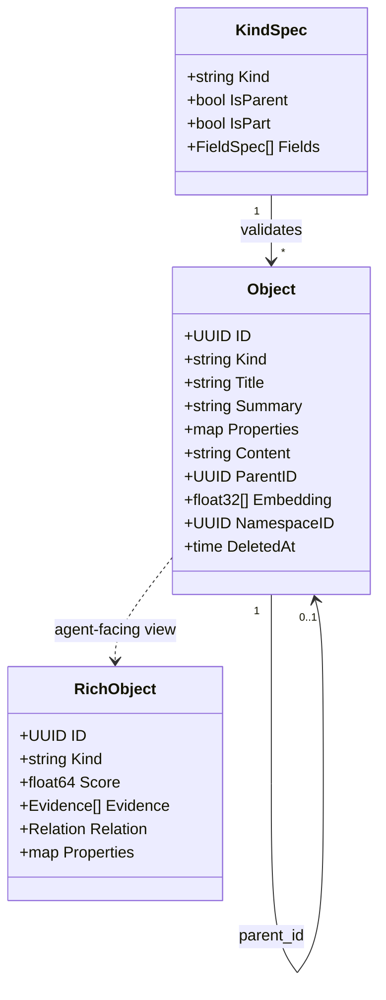
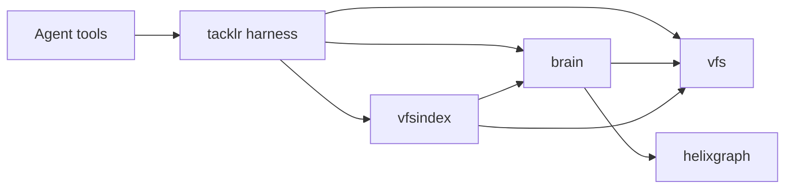
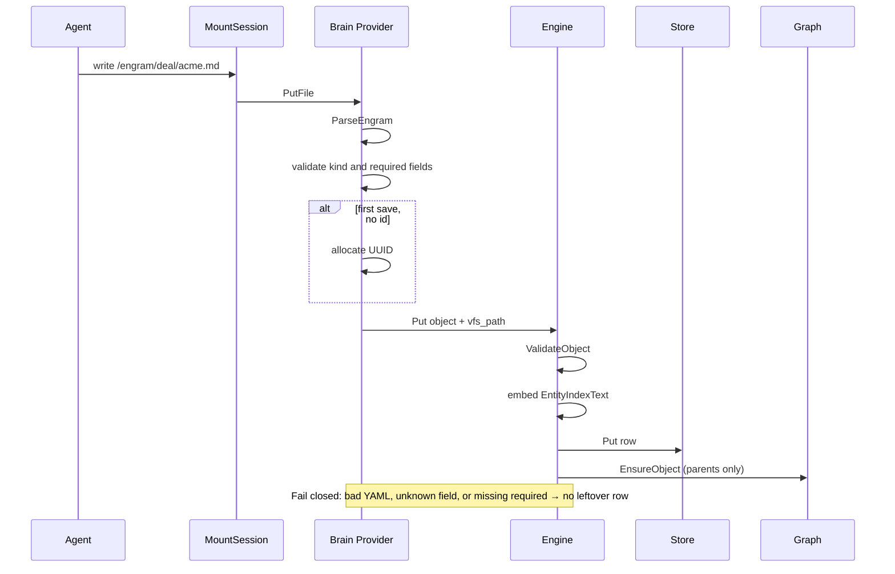
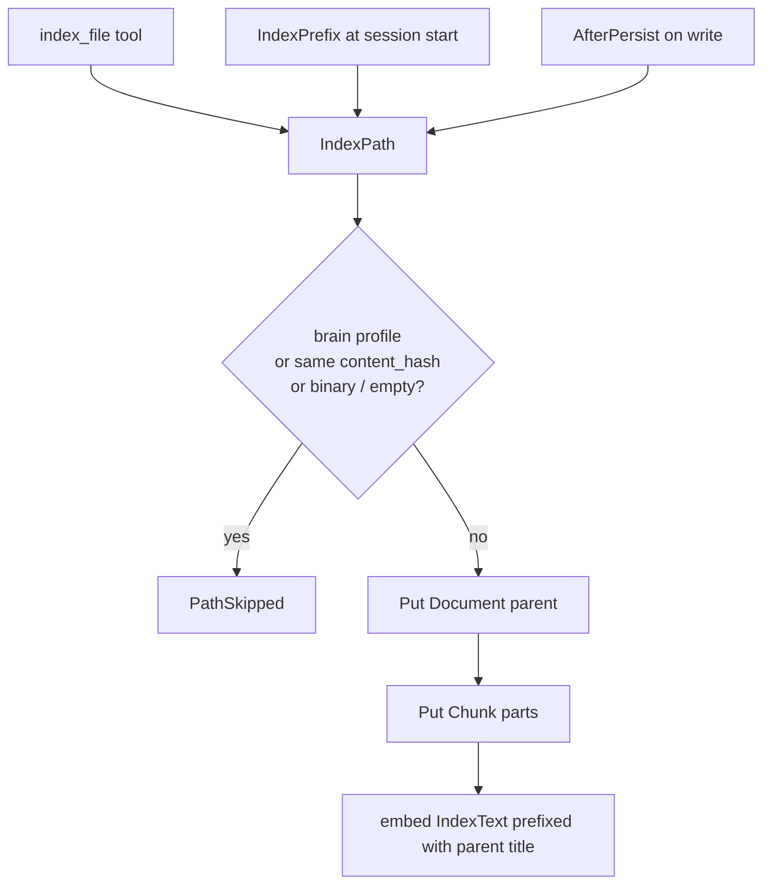
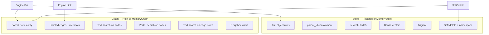
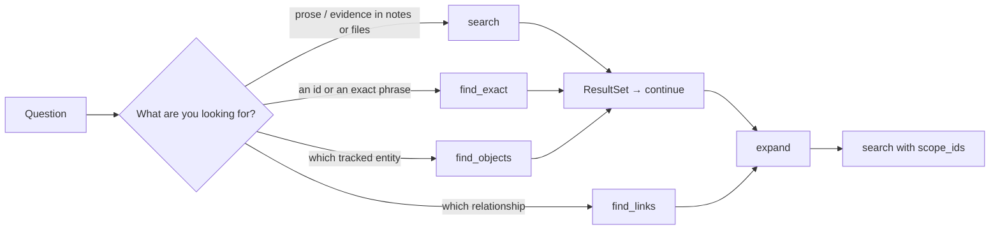
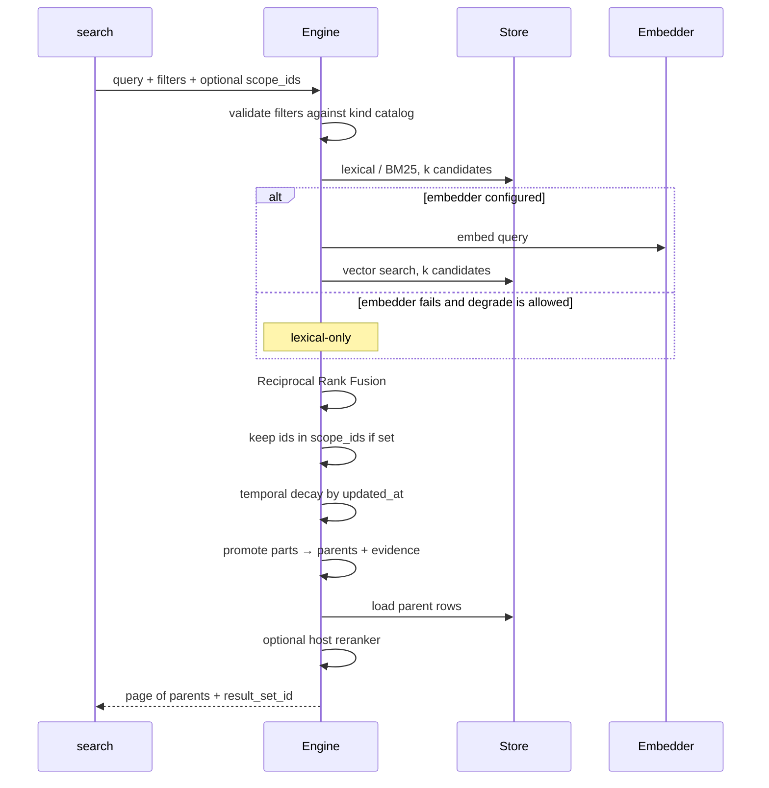
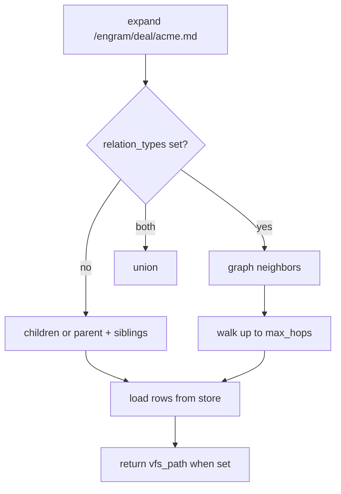

# Knowledge system (Brain)

This is the canonical guide to Tacklr’s knowledge base: how objects are stored, how
they appear as files, how search and the graph work, and how an agent is supposed
to use them.

You do not need to have read the rest of the Tacklr codebase first. Terms are
defined as they appear, and again in the [glossary](#glossary).

**Related**

| Doc | When to open it |
|-----|-----------------|
| [docs/vfs.md](vfs.md) | Mounts, file IR, provider persist, index *policy* on a mount |
| [`brain` package](https://pkg.go.dev/github.com/ryanaldo34/tacklr/brain) | Go API reference |
| [`vfsindex` package](https://pkg.go.dev/github.com/ryanaldo34/tacklr/vfsindex) | Artifact → Document/Chunk ingest API |
| [README](../README.md) | How Brain fits the rest of the harness |

---

## Who this is for

| Reader | What you should take away |
|--------|---------------------------|
| **Host / product engineer** | How to register kinds, wire Postgres (and optional Helix), mount `/engram`, and decide index policy |
| **Agent author / tool designer** | Which tool to call for which question; why `ls` never shows relationships |
| **Contributor** | Which package owns which job; what must not import what |

Tacklr is a Go **agent harness** (a framework, not a grab-bag of helpers). The
**host** is the application that constructs an agent. The **agent** is the model
plus the tools the harness injects. The **brain** is the host-owned knowledge
engine those tools call.

---

## Why this is not “RAG”

Classic RAG dumps the last *N* similar chunks into the prompt. That pollutes
context, mixes stale index text with live files, and has no notion of “this Deal
is linked to that Person.”

Tacklr’s knowledge system does four different jobs and keeps them separate:

1. **First-class objects** (Engrams) live in a database and show up as Markdown files.
2. **Workspace files** (artifacts) stay on disk or S3; a derived index makes them searchable.
3. **Relationships** live in a graph. They are not files and `ls` never lists them.
4. **Retrieval** lands on a parent object, then you open the *live* file — not a stale chunk body.

The ship of “stuff more chunks into the window” has sailed. Search here is
hybrid (keyword + vector), temporally biased, graph-aware, and scoped to a
namespace.

---

## The two jobs (do not mix)

Almost every design mistake in this area comes from treating these as the same thing.

| Job | What it is | Source of truth | How it becomes searchable | What the agent edits |
|-----|------------|-----------------|---------------------------|----------------------|
| **Engram** | A host-defined record: a Deal, Person, Fact, Memory, … | A row in the brain **store** | Writing the file *is* the object update (`Put`) | `/engram/deal/acme.md` (or a host root like `/deal/acme.md`) |
| **Artifact** | A normal file the agent is working on | Bytes on local disk, S3, or a bound Drive/Graph folder | **IndexPath** copies a Document + Chunks into the store | `/work/contract.md` or `/workspace/contracts/nda.pdf` — the real file |

```text
  Agent
    ├─ file tools     read, write, run_command
    └─ knowledge tools schema, search, find_exact, find_objects,
                       link, expand, find_links, save_*, continue
              │
         MountSession          ← the agent only sees virtual paths
    ┌─────────┼──────────────┐
    ▼         ▼              ▼
  Local     S3 / Drive / Graph   Brain Provider
  /work     /workspace/…         /engram/deal/acme.md
    │                        │
    │ IndexPath              │ parse Markdown + Put
    │ (optional, hash skip)  │
    ▼                        ▼
              brain.Engine
         ┌────────────┬──────────────┐
         │ Store      │ Graph        │
         │ Postgres   │ Helix        │
         │ or memory  │ or MemoryGraph│
         │            │              │
         │ full rows  │ parent nodes │
         │ BM25+vector│ + edges      │
         │ children   │ (no chunks)  │
         └────────────┴──────────────┘
```

**Rule:** do not index the brain mount back into itself. An Engram is already an
object. Re-chunking `/engram/deal/acme.md` as a Document would duplicate the
body and confuse search.

---

## What the agent sees

The agent never sees a host filesystem path, a bucket key, or a SQL row.

It sees:

- **Virtual paths** such as `/work/main.go` or `/engram/deal/acme.md`
- **Tools** the harness injects when the host wired Brain (and, for file tools, VFS)
- **Rich objects** from search: id, kind, title, score, optional evidence, optional `vfs_path`

A **virtual filesystem (VFS)** is one tree of paths whose backends the host chose.
Local disk, S3, and the brain all look the same at the tool layer. Details:
[docs/vfs.md](vfs.md). Workers share the host `MountSession` and brain engine;
they do not get a second FUSE.

Default Engram layout (the harness mounts this when Brain + VFS + a search
namespace are set, unless the host already mounted a brain profile):

```text
/engram/deal/acme.md
/engram/person/sam.md
```

Hosts can instead mount **roots** (`/deal/acme.md`). Same objects, different tree.

Relationships do **not** appear as files. There is no `.links` directory.
`run_command` → `ls` shows file names only. To see neighbors, the agent calls
`expand`.

---

## Object model

Everything in the store is one **object**. Kind and `parent_id` decide the role.



| Role | How you recognize it | Appears as a file? | In the graph? |
|------|----------------------|--------------------|---------------|
| **Parent / Engram** | `parent_id` is empty | Yes — `{slug}.md` | Yes (dual-written on `Put`) |
| **Part / Chunk** | `parent_id` is set | Never | Never |

**Kinds** are defined by the **host**, not by Tacklr. `Deal` and `Person` in tests
and examples are sample product types, not SDK types. You register them with
`ApplyKinds` / `WithKinds`.

- **Empty catalog** (“open mode”): any kind name and any properties are accepted.
- **Non-empty catalog**: unknown kinds are rejected; required fields must be
  present; unknown property keys fail the write.

Kind names must be path-safe: no `/` and no `..`. Only **parent** kinds become
directories.

Every durable object belongs to a **namespace** (a UUID the host sets on the
session). Retrieval never crosses namespaces. Wrong-namespace looks like
not-found.

---

## Packages and ownership



| Package | Owns | Must not |
|---------|------|----------|
| `vfs` | Mounts, bytes, document IR, `IndexPolicy` as a string | Import `brain` |
| `brain` | Objects, search, graph ports, Engram file codec, `vfs.Provider` | Import the harness |
| `vfsindex` | Artifact → Document/Chunk pipeline, schedulers, policy helpers | Be required to use VFS or Brain alone |
| `brain/helixgraph` | Helix client behind graph interfaces | Leak Helix types into tools |
| `tacklr` (harness) | Factory registration, default `/engram`, tools, skip-index | Own parse/index internals |

`vfs` and `brain` work alone. `vfsindex` is the optional composition layer
because it is the only package allowed to import both.

---

## Writing knowledge

### Engrams — the file *is* the object

`brain.BrainFactory` opens a `vfs.Provider`. A write to an Engram path parses
Markdown, validates, and `Put`s the object. A read serializes the object back
to the same format.

**File format** (Markdown + YAML front matter):

```markdown
---
id: 7c2a0000-0000-0000-0000-000000000001
domain: Deal
slug: acme
title: Acme renewal
stage: open
amount: 120000
---

Narrative body. Headings work with the VFS block IR (`block_id`).
```

| Front-matter key | Goes to |
|------------------|---------|
| `id` | `Object.ID` (stable UUID) |
| `domain` or `kind` | `Object.Kind` |
| `slug` | filename stem + `properties.slug` |
| `title` | `Object.Title` (defaults to slug) |
| any other key | `Object.Properties` (must be in the kind schema when the catalog is non-empty) |
| body after the closing `---` | `Object.Content` |

`vfs_path` is stored on the object so graph tools can resolve path ↔ id. It is
**not** written back into the file.

A `---` line *inside* the YAML block ends front matter (standard limitation).
The body may contain `---`.



**First save** without `id` allocates a UUID. The next read rewrites front
matter so the id is visible.

**Rename** is not a move. Delete the old file, create the new one, re-`link`.

**`save_*` tools** (for example `save_discovery`) are a thin write: if a brain
mount exists they write the Engram path; otherwise they call `Engine.Put`.
Scratch `/memory` is **not** attached when a brain mount exists.

IR edits (`write` / `WriteDocument`) persist the same way:
the serialized Markdown is parsed and `Put`.

### Artifacts — the file stays where it is

A file on `/work` or S3 is **not** an Engram. Indexing makes a *mirror* in the
store so `search` can find it.

```text
/work/contract.md     ← live bytes (source of truth)
        │
        ▼ IndexPath
  Document   id = SHA1(namespace + virtual path)
             props: vfs_path, content_hash, size, mtime
    ├─ Chunk  lines 1–40     start_line, end_line, block_id, heading_path
    └─ Chunk  lines 41–80
```

Markdown is chunked by heading/preamble blocks when the VFS IR exposes them;
other text uses fixed line windows (default 40 lines).



The parent Document holds metadata and a content hash — not a second
agent-editable full-file body. After search, the agent opens the **live** path
with `read` using `vfs_path` + `start_line` / `block_id`.

**Index policies** (set on the mount; empty means `selective` when the index
bridge is on):

| Policy | When indexing runs |
|--------|--------------------|
| `none` | Never automatically; `index_file` **errors**. Brain mounts get this. |
| `selective` | Only `index_file` / a host `IndexPath` call. After a successful `index_file`, later writes reindex that path. |
| `prefix` | Walk the mount at bridge start, then reindex on persist. |
| `watch` | Same triggers as `prefix` (host-facing name). |

Same `content_hash` → skip (no re-chunk). Missing file → soft-delete the mirror
(`PathRemoved`). `unindex` removes the mirror without touching the VFS file.

Brain-profile mounts are never walked. Engram writes go through the Provider,
not `IndexPath`.

---

## Two backends: store and graph

They are complementary. Do not treat Helix as a second document database.



| | Store | Graph |
|-|-------|-------|
| **Holds** | Full rows, chunks, embeddings, filters | Parent nodes + edges |
| **Answers** | `search`, `find_exact`, `read_object`, expand-children | `find_objects`, `link`, expand-relations, `find_links` |
| **Required?** | Yes | Optional. Without it: no `link` / `find_objects` / named-relation expand |

**Write rules**

- Only **parents** become graph nodes. Chunks never go to the graph.
- `Put` upserts the node **in place** so existing edges survive. If the graph
  write fails after the store write, the row stays (store is source of truth);
  retry `Put` after fixing the graph.
- `SoftDelete` removes the **graph node first**, then marks the row deleted.
  If the store delete then fails, a later `Put` recreates the node.
- Graph search returns ids; the engine **hydrates** full rows from the store
  under the current namespace. Ids that are missing or out of scope disappear.

**What gets embedded** (one vector dimension per process):

| Object | Text that is embedded |
|--------|------------------------|
| Parent / Engram | `EntityIndexText`: title, summary, scalar properties (sorted keys), body capped at 2 000 runes |
| Part / Chunk | `IndexText` (title + summary + content), prefixed with the parent title |

So `find_objects "open renewal"` can match a Deal whose `stage` property is
`open`, not only the narrative body.

A host that uses Helix must `Bootstrap` (or `EnsureSearchIndexes`) so object
search is actually on. `MemoryGraph` is always ready and is what tests use.

---

## Search: four ways to land

Pick the landing that matches the question. Then page with `continue`, then
walk with `expand`.



### `search` — corpus hybrid

Use for “what in the notes or indexed files supports this?”

Hits are often **chunks**. The engine does **not** return those chunks as the
primary result. It **promotes** them to their parent and attaches the best
chunks as **evidence** (snippet, score, `start_line`, `block_id`).



Production defaults (overridable on the engine, not per tool call): 40
candidates per channel, RRF `k=60`, mild time decay `λ=0.02`, 3 evidence
chunks, page size 10 (max 50).

Indexed file recall is the same pipeline via `search` (prefer hits with
`vfs_path`). That is not a behavior-preserving stand-in for live `rg`.
Live grep is `run_command` → `rg`.

**`scope_ids`** restricts candidates to those ids or their children. After you
`expand` a Deal, search the neighborhood instead of the whole corpus.

### `find_exact` — equality first, no dense channel

1. If the query is a UUID, load that object.
2. Otherwise fuse lexical + **trigram** (typo-tolerant) lists.
3. Same promotion and paging as `search`.

Use for ids, titles, and “that exact phrase.”

### `find_objects` — entity find

Use for “which Deal / Person / Fact is this about?” This searches **graph
nodes**, not chunk bodies. There is no evidence path.

Helix text + vector lists are fused with RRF, then rows are loaded from the
store. Kind filters and property filters apply on **store truth**, not on
whatever Helix happened to index.

Requires a graph that implements object search (`MemoryGraph` or a bootstrapped
Helix).

### `find_links` — land on an edge

Searches **edge note text** for a required relation label (`about`,
`has_contact`, …). Both endpoints are hydrated under the namespace. The tool
prefers `from_path` / `to_path` when `vfs_path` is set.

On Helix the host must create an edge text index for that label. `MemoryGraph`
substring-matches notes (fine for tests).

### Filters and `schema`

`schema()` is how the agent learns what exists. It returns kinds, descriptions,
and `filterable_fields`, plus which tools accept those fields
(`search`, `find_exact`, `find_objects`).

Filter map keys:

- Core: `kind`, `title`, `created_after`, `created_before`, `updated_after`, `updated_before`
- Anything else: an object **property**. When the catalog is non-empty, the key
  must be listed on that kind, and a kind (or `find_objects.kinds`) is required.

### `continue`

Each `search` / `find_exact` / `find_objects` / large `expand` **replaces** the
session’s one active result set (ordered ids). `continue` pages it. The set is
checkpointed with the agent thread.

---

## Graph: folders vs relationships

Two different meanings of “neighbor”:

| Kind | Stored as | How you ask | Example |
|------|-----------|-------------|---------|
| **Containment** | `parent_id` on the store row | `expand` with no `relation_types` | Document → its Chunks |
| **Relation** | A labeled graph edge | `expand` with `relation_types` | Deal → Person, `has_contact` |



- Default `expand` is containment only.
- Named types need a graph backend. Default depth is 1 hop (capped at 4).
- If the graph fails and containment was also requested, expand can degrade to
  containment-only.
- `ls` never lists edges. Tool descriptions say this on purpose.

`link` / `unlink` require both ends to exist in the namespace, not be
soft-deleted, and **not** be chunks. Paths resolve through `vfs_path`. An
unindexed `/work/doc.md` cannot be linked until `index_file` (or a prefix
policy) has created a Document id.

Optional edge metadata (`note`, `status`, `role`, `confidence`, `evidence_id`)
comes back on `expand`.

Hosts can register named expand templates (`WithExpandRecipes`) so a product
can say “deal contacts” without baking that product into the SDK.

---

## Agent tools

Injected when the host sets `AgentOptions.Brain` (file-backed tools also need
VFS + a search namespace). Isolated VFS with no Brain: file tools only.

| Tool | Use it when | Backs onto |
|------|-------------|------------|
| `schema` | You need kind names and filter keys | Kind catalog |
| `search` | You need evidence in notes or indexed files | Store hybrid + parent promotion |
| `find_exact` | You have an id or a precise phrase | Equality / trigram + promotion |
| `find_objects` | You need the entity, not a passage | Graph nodes → store hydrate |
| `read_object` | You have an id and the hit has no `vfs_path` | `Engine.Read` |
| `read` / `write` | You are editing or citing a path | VFS (any mount, including `/engram`) |
| `save_*` | You want a one-shot create/update | Provider write, or `Put` if no brain mount |
| `index_file` / `unindex` | You must (un)mirror an artifact | `IndexPath` |
| `link` / `unlink` | You are asserting a relationship | Graph edges |
| `expand` | You already have a path or id | Containment and/or neighbors |
| `find_links` | You are looking for a relationship by its note | Edge text search |
| `continue` | The last page set `has_more` | Session result set |
| `run_command` | You need live `ls` / `fd` / `find` / `rg` on the FUSE tree | Host shell, cwd = `HostDir` |

### Suggested loop

```text
schema()
    │
find_objects  or  search / find_exact     ← land
    │
expand  /  find_links                     ← walk
    │
search(scope_ids = those parents)         ← neighborhood corpus
    │
read on vfs_path                          ← live bytes, not the chunk snapshot
```

---

## A concrete walkthrough

The host registered kinds `Deal` and `Person`, wired Postgres + Helix + VFS,
and let the harness mount `/engram`.

1. The agent writes `/engram/deal/acme.md` and `/engram/person/sam.md`.
   Each `Put`s a parent row and upserts a graph node whose search text includes
   title, `stage`, and a capped body.
2. `link from=/engram/deal/acme.md to=/engram/person/sam.md relation_type=has_contact role=buyer`
3. `index_file /work/nda.md` creates a Document + Chunks with
   `vfs_path=/work/nda.md`. A later write with the same hash is skipped.
4. `link from=/work/nda.md to=/engram/deal/acme.md relation_type=about` —
   this fails until step 3, because an unindexed artifact has no object id.
5. `find_objects "acme renewal"` hits the Deal **node** and hydrates the
   Postgres row.
6. `expand path=/engram/deal/acme.md relation_types=["has_contact"]` returns
   `/engram/person/sam.md`.
7. `search "indemnity"` with `scope_ids` of those parents runs BM25 + vector
   on **chunks**, promotes to the Deal and the NDA Document, and attaches
   line-range evidence.
8. The agent calls `read /work/nda.md` at `start_line` from evidence —
   the live file, not the chunk snapshot.

---

## Wiring it as a host

Minimum (in-memory, no graph, no files):

```go
store := brain.NewMemoryStore()
eng, err := brain.NewEngine(store, brain.WithKinds(
    brain.KindSpec{Kind: "Fact", IsParent: true, Fields: []brain.FieldSpec{
        {Name: "topic", Type: brain.FieldTypeString},
    }},
))
// AgentOptions{Brain: eng, ...}  → search / save_* / schema / read
```

Production-shaped:

```go
store, err := brain.NewPostgresStore(pool)
g, err := helixgraph.New(helixURL)
if err := g.Bootstrap(ctx, false); err != nil { /* ... */ }

eng, err := brain.NewEngine(store,
    brain.WithEmbedder(emb),          // hybrid search + Put embeddings
    brain.WithGraph(g),               // link / find_objects / named expand
    brain.WithKinds(dealSpec, personSpec),
)
if err := eng.ApplyKinds(ctx, vfsindex.MountIndexKinds()...); err != nil {
    // Document + Chunk field specs when the catalog is non-empty
}

// AgentOptions:
//   Brain:           eng
//   VFS:             registry + mounts (including /work)
//   SearchNamespace: tenant UUID
//
// Harness then:
//   registers BrainFactory (profile "brain")
//   mounts /engram (prefix, IndexPolicy=none) unless you already mounted one
//   starts vfsindex.Bridge (skips profile "brain")
//   injects file tools + knowledge tools
```

Factory mount params (`Profile: "brain"`):

| Param | Meaning |
|-------|---------|
| `mode` | `prefix` (default, `/engram/<kind>/<slug>.md`) or `roots` |
| `kind` | Required for `roots` — one kind per mount |
| `kinds` | Comma allow-list. Empty catalog: pass this, or listing shows only kinds that already have objects |

Optional knobs: `WithReranker` (post-hydrate product scoring),
`WithExpandRecipes` (named expand templates), `WithConfig` (candidate *k*, decay, limits).

Integration tests that need real backends use Testcontainers (Postgres image
under `brain/testdata`, Helix `enterprise-dev`). They skip under `-short`.

---

## Isolation and failure modes

| Situation | Behavior |
|-----------|----------|
| Wrong namespace | `Get` / search look like not found. Graph ids that fail hydrate are dropped. |
| Soft-deleted object | Hidden from Get and search. Graph node is already gone. |
| Embedder down at **query** time | `search` / `find_objects` can run lexical-only (default). Set `FailOnEmbedderError` to surface the error. |
| Embedder down at **Put** time | **Fail closed.** An unindexed parent is not persisted. |
| Graph down at expand | Can degrade to containment if containment was requested. |
| Graph missing entirely | `link` / `find_objects` / named-relation expand error with a clear sentinel. |
| Bad Engram write | Parse/validate error; no leftover object. |

---

## Contributor map

| Area | Start here |
|------|------------|
| Object + search types | `brain/types.go` |
| Engine construct / config | `brain/engine.go` |
| Corpus search / exact / continue | `brain/search.go` |
| RRF + temporal decay | `brain/rank.go` |
| Parent promotion + evidence | `brain/promote.go` |
| Entity find | `brain/find_objects.go` |
| Edge find | `brain/find_links.go` |
| Expand / recipes | `brain/expand.go` |
| Put / Link / embeddings | `brain/write.go` |
| Kind catalog | `brain/kind.go` |
| Engram Markdown codec | `brain/engramfile.go` |
| VFS Provider + factory | `brain/provider.go` |
| Store ports | `brain/store.go` |
| Graph ports + MemoryGraph | `brain/graph.go` |
| Helix adapter | `brain/helixgraph/` |
| Artifact indexer | `vfsindex/indexer.go` |
| Index policy + bridge | `vfsindex/policy.go`, `vfsindex/bridge.go` |
| Default `/engram` + factory | `agent_construct.go` |
| Knowledge tools | `tools_brain.go` |
| Index tools | `tools_vfsindex.go` |

Tests are outcome-oriented integration tests (in-memory Engine + local VFS
jail). We assert what *should* happen (write visible as an object, expand
returns paths), not that a private helper was called.

---

## Out of scope for this version

- Sidecar link files or virtual neighbor directories (`ls` is never a graph query)
- Hardcoded product types (Deal, Person, …) inside the SDK
- Agent-defined kinds (hosts own the schema for determinism)
- Rename-as-move for Engrams
- Indexing the brain Provider mount as Document/Chunk artifacts

---

## Glossary

| Term | Meaning |
|------|---------|
| **Host** | The application that constructs the engine, kinds, mounts, and agent |
| **Agent** | The model plus harness-injected tools |
| **Brain / Engine** | The knowledge facade: `Put`, search, expand, link |
| **Store** | Durable object rows (Postgres or in-memory) |
| **Graph** | Parent nodes + labeled edges (Helix or in-memory) |
| **Kind / Domain** | A host-registered object type (`KindSpec`). Same idea; “domain” is the product word, “kind” is the field name |
| **Engram** | A first-class parent object, shown as a Markdown file |
| **Artifact** | A file that lives on local/S3; may be indexed into Document + Chunks |
| **Document / Chunk** | Default kinds for an indexed artifact (`vfsindex.MountIndexKinds`) |
| **VFS** | Virtual filesystem: one path tree over several backends |
| **Provider** | Bytes (or Engram parse/format) behind one mount |
| **Namespace** | Host UUID that isolates all retrieval and writes |
| **Scope** | The engine’s view of that namespace on a call |
| **`vfs_path`** | Absolute virtual path stored on an object so tools can speak paths |
| **Evidence** | Chunks that justified a parent `search` hit |
| **Result set** | Ordered ids from the last search, paged by `continue` |
| **Containment** | Parent/child via `parent_id` (not a graph edge) |
| **RRF** | Reciprocal Rank Fusion — merges ranked lists without mixing raw scores |
| **Helix** | Optional graph database used through `brain/helixgraph` |
| **IndexPath** | Single function that mirrors one artifact path into Document + Chunks |
| **Fail closed** | A bad write or a failed embed on `Put` does not leave a half-object |
