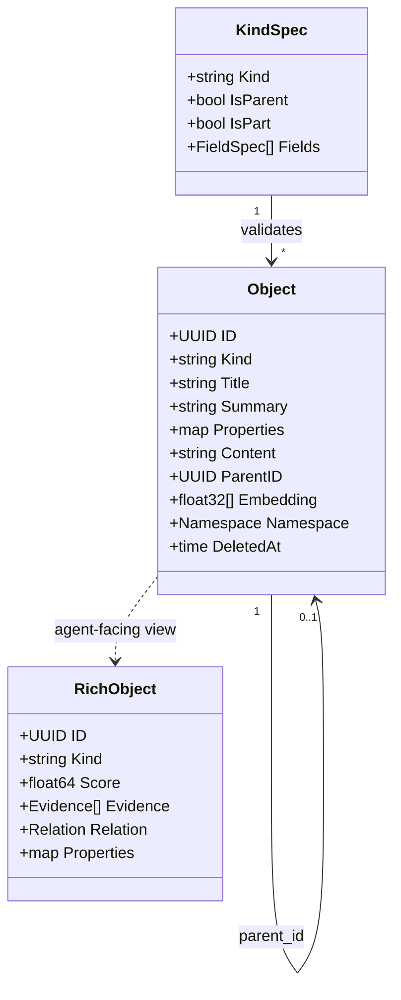
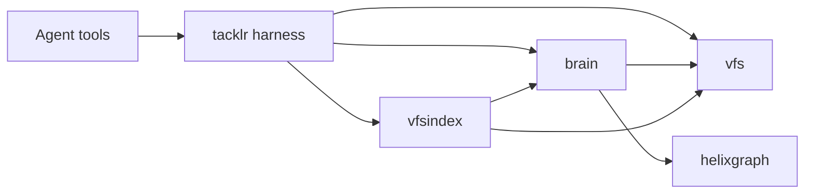
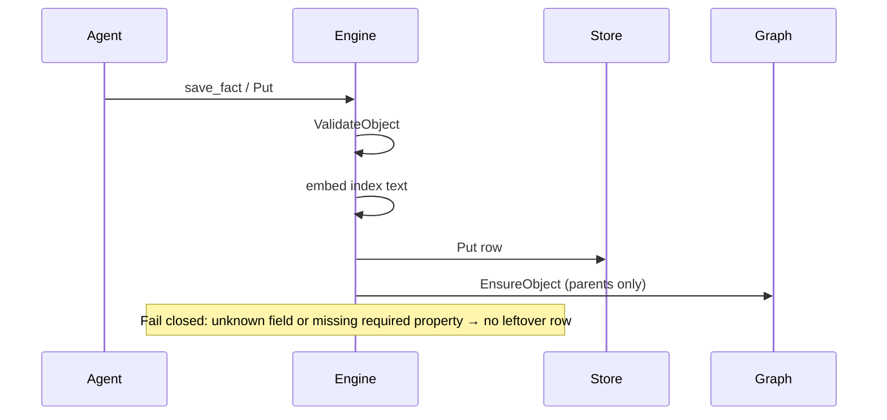
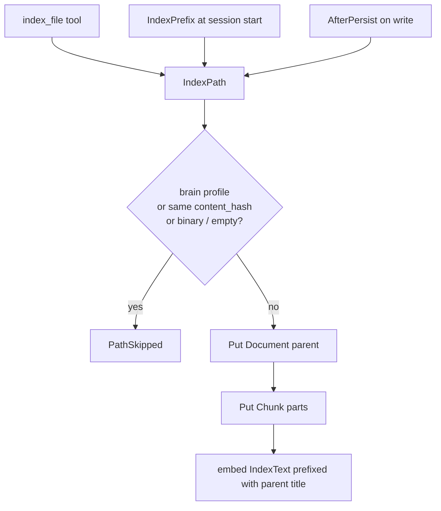
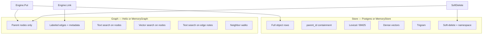
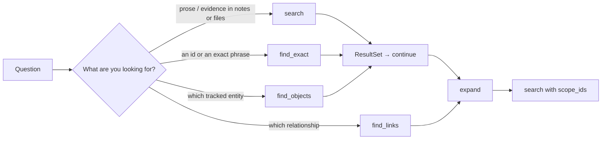
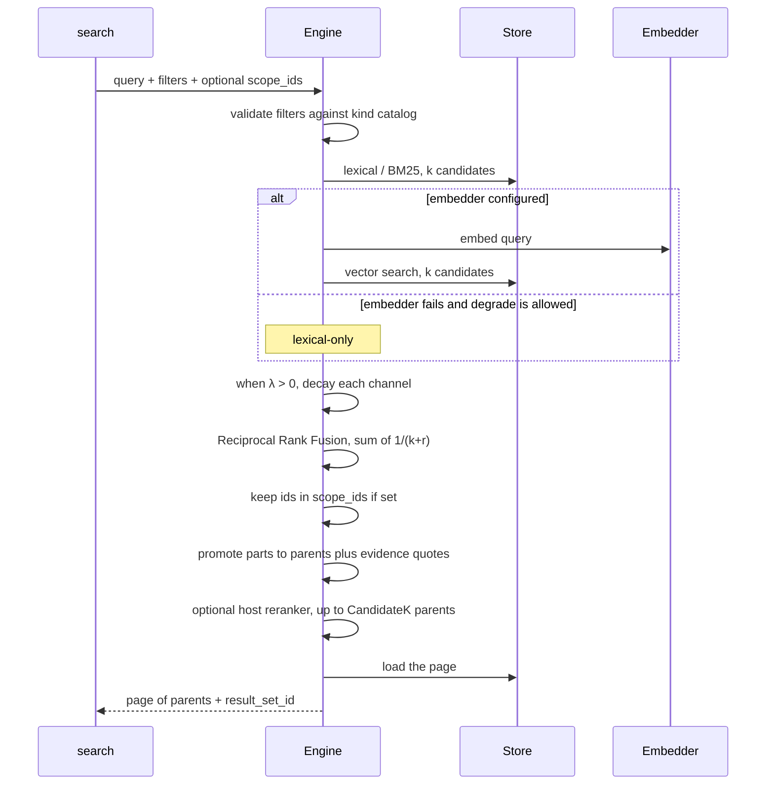
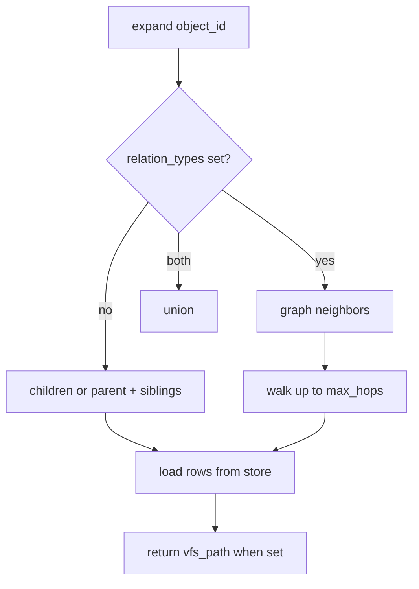

# Knowledge system (Brain)

This is the canonical guide to Tacklr’s knowledge base: how objects are stored, how
they appear as files, how search and the graph work, and how an agent is supposed
to use them. The engine is generic: inject a `brain.Store` and optional graph.
`brain/postgres` and `brain/helixgraph` are optional backends.

You do not need to have read the rest of the Tacklr codebase first. Terms are
defined as they appear, and again in the [glossary](#glossary).

**Related**

| Doc | When to open it |
|-----|-----------------|
| [docs/vfs.md](vfs.md) | Mounts, file IR, provider persist, index *policy* on a mount |
| [`brain` package](https://pkg.go.dev/github.com/ryanaldo34/tacklr/brain) | Go API reference |
| [`vfsindex` package](https://pkg.go.dev/github.com/ryanaldo34/tacklr/vfsindex) | Artifact → Document/Chunk ingest API |
| [README](../README.md) | How Brain fits the rest of the harness |

---

## Who this is for

| Reader | What you should take away |
|--------|---------------------------|
| **Host / product engineer** | How to register kinds, inject `postgres.Store` and optional `helixgraph.Graph`, and decide which workspace mounts to index |
| **Agent author / tool designer** | Which tool to call for which question; why `ls` never shows relationships |
| **Contributor** | Which package owns which job; what must not import what |

Tacklr is a Go **agent harness** (a framework, not a grab-bag of helpers). The
**host** is the application that constructs an agent. The **agent** is the model
plus the tools the harness injects. The **brain** is the host-owned knowledge
engine those tools call.

---

## Four jobs, kept separate

The knowledge system does four different jobs on purpose:

1. **First-class objects** (Engrams) live in a database and show up as Markdown files.
2. **Workspace files** (artifacts) stay on disk or S3; a derived index makes them searchable.
3. **Relationships** live in a graph. They are not files and `ls` never lists them.
4. **Retrieval** lands on a parent object, then you open the *live* file — not a stored chunk body.

Search is hybrid (keyword + vector), biased toward recently updated objects,
graph-aware when a graph is attached, and scoped to a namespace. The agent
queries when it needs a fact; the harness does not dump a static result list
into every prompt.

A plan handoff saves the exact context window as **session messages** in
`session_messages` before the window is replaced. Each row's namespace is the
host `SearchNamespace` with the session id appended as the last attribute
(`session`). `search` and `find_exact` return those messages together with
knowledge rows under the host namespace. Another session's tail is a different
namespace, so its messages are not in the page. `save_fact`, `save_memory`, and
`save_discovery` do not append the session attribute. Closing the session
deletes its session messages.

Session messages are not the harness checkpoint. The checkpoint
(`SessionCheckpoint`) is the live window the runtime saves and restores.
Session messages are earlier windows kept for search.

Compress and a specialist result may still write **Episode** objects (a summary
and capped discarded text) into the knowledge store. Those are not product kinds
(Fact, Memory, Discovery). Hosts with a non-empty catalog should register
`EpisodeKinds()` alongside `vfsindex.MountIndexKinds()`. A failed Episode write
does not block the window rebuild. A failed session-message save does stop the
handoff, and the live window stays.

---

## The two jobs (do not mix)

Almost every design mistake in this area comes from treating these as the same thing.

| Job | What it is | Source of truth | How it becomes searchable | What the agent edits |
|-----|------------|-----------------|---------------------------|----------------------|
| **Knowledge record** | A host-defined record: a Deal, Person, Fact, Memory, … | A row in the brain **store** | `save_*` or `Engine.Put` writes the row. `search` reads it | The record itself (`read_object`), not a file |
| **Artifact** | A normal file the agent is working on | Bytes on local disk, S3, or a bound Drive/Graph folder | **IndexPath** copies a Document + Chunks into the store | `/workspace/work/contract.md` or `/workspace/contracts/nda.pdf` |

```text
  Agent
    ├─ file tools     read, write, run_command
    └─ knowledge tools schema, search, find_exact, find_objects,
                       link, expand, find_links, save_*, continue
              │
         MountSession          ← files only
    ┌─────────┴──────────────┐
    ▼                        ▼
  Local                  S3 / Drive / Graph
  /workspace/work        /workspace/…
    │
    │ IndexPath (optional, hash skip)
    ▼
              brain.Engine   ← save_* / search, no file mount
         ┌────────────┬──────────────┐
         │ Store      │ Graph        │
         │ Postgres   │ Helix        │
         │ or memory  │ or MemoryGraph│
         │            │              │
         │ full rows  │ parent nodes │
         │ BM25+vector│ + edges      │
         │ children   │ (no chunks)  │
         └────────────┴──────────────┘
```

**Rule:** a knowledge record is already an object. Do not also store it as a workspace file and index that file. Search would return the body twice.

---

## What the agent sees

The agent never sees a host filesystem path, a bucket key, or a SQL row.

It sees:

- **Virtual paths** such as `/workspace/work/main.go` for files. Knowledge records are ids, not paths
- **Tools** the harness injects when the host wired Brain (and, for file tools, VFS)
- **Rich objects** from search: id, kind, title, score, optional evidence, optional `vfs_path`

A **virtual filesystem (VFS)** is one tree of paths whose backends the host chose.
Local disk, S3, Drive, and Graph look the same at the file-tool layer. Knowledge does not. Details:
[docs/vfs.md](vfs.md). Workers share the host `MountSession` and brain engine;
they do not get a second FUSE.

Relationships do **not** appear as files. There is no `.links` directory.
`run_command` → `ls` shows file names only. To see neighbors, the agent calls
`expand` with an object id or an indexed path.

---

## Object model

Everything in the store is one **object**. Kind and `parent_id` decide the role.


```mermaid
classDiagram
    class Object {
        +UUID ID
        +string Kind
        +string Title
        +string Summary
        +map Properties
        +string Content
        +UUID ParentID
        +float32[] Embedding
        +Namespace Namespace
        +time DeletedAt
    }

    class KindSpec {
        +string Kind
        +bool IsParent
        +bool IsPart
        +FieldSpec[] Fields
    }

    class RichObject {
        +UUID ID
        +string Kind
        +float64 Score
        +Evidence[] Evidence
        +Relation Relation
        +map Properties
    }

    KindSpec "1" --> "*" Object : validates
    Object "1" --> "0..1" Object : parent_id
    Object ..> RichObject : agent-facing view
```

| Role | How you recognize it | Appears as a file? | In the graph? |
|------|----------------------|--------------------|---------------|
| **Parent / Engram** | `parent_id` is empty | Yes — `{slug}.md` | Yes (dual-written on `Put`) |
| **Part / Chunk** | `parent_id` is set | Never | Never |

Parts are not files. `search` looks at parts (indexed workspace files, or
chunks the host writes with `ReplaceParts`). The Engram Markdown body lives
on the parent and is found with `find_objects` until parts exist.

**Kinds** are defined by the **host**, not by Tacklr. `Deal` and `Person` in tests
and examples are sample product types, not SDK types. You register them with
`ApplyKinds` / `WithKinds`.

- **Empty catalog** (“open mode”): any kind name and any properties are accepted.
- **Non-empty catalog**: unknown kinds are rejected; required fields must be
  present; unknown property keys fail the write.

Kind names must be path-safe: no `/` and no `..`. Only **parent** kinds become
directories.

Every durable object belongs to a **namespace**: ordered named attributes
(for example `org=acme`, `workspace=west`). `AgentOptions.SearchNamespace` is the
host ceiling. Each brain tool call may pass extra `namespace` attrs to narrow
that search; it cannot change the host's values. Continue uses the namespace
stamped on the result set. Retrieval keeps a row when every scope attr is on
the object (`Covers`). Wrong-namespace looks like not-found.

---

## Packages and ownership


```mermaid
flowchart LR
    Agent[Agent tools]
    Harness[tacklr harness]
    VFS[vfs]
    Brain[brain]
    Index[vfsindex]
    Helix[helixgraph]

    Agent --> Harness
    Harness --> VFS
    Harness --> Brain
    Harness --> Index
    Brain --> VFS
    Brain --> Helix
    Index --> VFS
    Index --> Brain
```

| Package | Owns | Must not |
|---------|------|----------|
| `vfs` | Mounts, bytes, document IR, `IndexPolicy` as a string | Import `brain` |
| `brain` | Objects, search, graph ports | Import the harness or `vfs` |
| `vfsindex` | Artifact → Document/Chunk pipeline, schedulers, policy helpers | Be required to use VFS or Brain alone |
| `brain/helixgraph` | Helix client behind graph interfaces | Leak Helix types into tools |
| `tacklr` (harness) | Knowledge tools and file tools | Own parse/index internals |

`vfs` and `brain` work alone. `vfsindex` indexes workspace files into the brain and is the package that imports both.

---

## Writing knowledge

`save_discovery`, `save_fact`, and `save_memory` call `Engine.Put`. The title is required. `object_id` updates that row. `read_object` and `search` return it. Indexed workspace files still store `vfs_path` so `link` and `expand` can take a path. A knowledge record has no path.


```mermaid
sequenceDiagram
    participant Agent
    participant E as Engine
    participant S as Store
    participant G as Graph

    Agent->>E: save_fact / Put
    E->>E: ValidateObject
    E->>E: embed index text
    E->>S: Put row
    E->>G: EnsureObject (parents only)
    Note over E: Fail closed: unknown field or missing required property → no leftover row
```

IR edits (`write` / `WriteDocument`) persist the same way:
the serialized Markdown is parsed and `Put`.

### Artifacts — the file stays where it is

A file on `/work` or S3 is **not** an Engram. Indexing makes a *mirror* in the
store so `search` can find it.

```text
/work/contract.md     ← live bytes (source of truth)
        │
        ▼ IndexPath
  Document   id = SHA1(namespace + virtual path)
             props: vfs_path, content_hash, size, mtime
    ├─ Chunk  lines 1–40     start_line, end_line, block_id, heading_path
    └─ Chunk  lines 41–80
```

Markdown is chunked by heading/preamble blocks when the VFS IR exposes them;
other text uses fixed line windows (default 40 lines).


```mermaid
flowchart TD
    A[index_file tool] --> IP[IndexPath]
    B[IndexPrefix at session start] --> IP
    C[AfterPersist on write] --> IP
    IP --> Skip{brain profile<br/>or same content_hash<br/>or binary / empty?}
    Skip -->|yes| Out[PathSkipped]
    Skip -->|no| Doc[Put Document parent]
    Doc --> Chunks[Put Chunk parts]
    Chunks --> Emb[embed IndexText prefixed with parent title]
```

The parent Document holds metadata and a content hash — not a second
agent-editable full-file body. After search, the agent opens the **live** path
with `read` using `vfs_path` + `start_line` / `block_id`.

**Index policies** (set on the mount; empty means `selective` when the index
bridge is on):

| Policy | When indexing runs |
|--------|--------------------|
| `none` | Never automatically; `index_file` **errors**. Brain mounts get this. |
| `selective` | Only `index_file` / a host `IndexPath` call. After a successful `index_file`, later writes reindex that path. |
| `prefix` | Walk the mount at bridge start, then reindex on persist. |
| `watch` | Same triggers as `prefix` (host-facing name). |

Same `content_hash` → skip (no re-chunk). Missing file → soft-delete the mirror
(`PathRemoved`). `unindex` removes the mirror without touching the VFS file.

Brain-profile mounts are never walked. Engram writes go through the Provider,
not `IndexPath`.

---

## Two backends: store and graph

They are complementary. The store is the document corpus and the source of
truth. The graph is tracked records and how they relate. Do not treat Helix as
a second document database.


```mermaid
flowchart TB
    subgraph Store["Store — Postgres or MemoryStore"]
        Rows[Full object rows]
        Parts[parent_id containment]
        BM25[Lexical / BM25]
        Vec[Dense vectors]
        Tri[Trigram]
        Soft[Soft-delete + namespace]
    end

    subgraph Graph["Graph — Helix or MemoryGraph"]
        Nodes[Parent nodes only]
        Edges[Labeled edges + metadata]
        Txt[Text search on nodes]
        GVec[Vector search on nodes]
        ETxt[Text search on edge notes]
        Walk[Neighbor walks]
    end

    Put[Engine.Put] --> Rows
    Put --> Nodes
    Link[Engine.Link] --> Edges
    SoftDel[SoftDelete] --> Nodes
    SoftDel --> Soft
```

| | Store | Graph |
|-|-------|-------|
| **Holds** | Full rows, chunks, embeddings, filters | Parent nodes + edges |
| **Answers** | `search`, `find_exact`, `read_object`, expand-children | `find_objects`, `link`, expand-relations, `find_links` |
| **Required?** | Yes | Optional. Without it: no `link` / `find_objects` / named-relation expand |
| **What the query matches** | Parts (chunks of notes and indexed files) | Parent records (a Deal, a Person, …) |

`search` and `find_exact` look at **parts** (`parent_id` set): title, summary,
and body. Hits promote to the parent with evidence. An Engram that has no
parts does not appear there — use `find_objects`, or add chunks (host ingest).

`find_objects` looks at **parent** nodes in the graph: the record’s title,
summary, body, and indexed properties. Structured fields belong in **filters**,
not in the query string. The same filter keys work on corpus search, but they
apply to the part row, not the parent.

Exact lookups (`Get`, `GetByProperty`, `ListByKind`, `find_exact` with a UUID)
always go to the store.

**Write rules**

- Only **parents** become graph nodes. Chunks never go to the graph.
- `Put` upserts the node **in place** so existing edges survive. If the graph
  write fails after the store write, the row stays (store is source of truth);
  retry `Put` after fixing the graph.
- `SoftDelete` removes the **graph node first**, then marks the row deleted.
  If the store delete then fails, a later `Put` recreates the node.
- Graph search returns ids; the engine **hydrates** full rows from the store
  under the current namespace. Ids that are missing or out of scope disappear.

**What gets embedded** (one vector dimension per process):

| Object | Text that is embedded |
|--------|------------------------|
| Parent / Engram | `EntityIndexText`: title, summary, indexed scalar properties, full body |
| Part / Chunk | `IndexText` (title + summary + content), prefixed with the parent title |

`WithIndexText` can rewrite that document at Put (prefix, replace, or drop
fields) without changing the stored object. The same string is embedded and
written as graph search text.

So `find_objects "open renewal"` can match a Deal whose `stage` property is
`open`, not only the narrative body. Corpus `search` still matches chunk text,
not those parent fields.

A host that uses Helix must `Bootstrap` (or `EnsureSearchIndexes`) so object
search is actually on. `MemoryGraph` is always ready and is what tests use.

---

## Search: four ways to land

Pick the landing that matches the question. Then page with `continue`, then
walk with `expand`.


```mermaid
flowchart LR
    Q[Question] --> C{What are you looking for?}
    C -->|prose / evidence in notes or files| Search[search]
    C -->|an id or an exact phrase| Exact[find_exact]
    C -->|which tracked entity| FO[find_objects]
    C -->|which relationship| FL[find_links]
    Search --> RS[ResultSet → continue]
    Exact --> RS
    FO --> RS
    RS --> Ex[expand]
    FL --> Ex
    Ex --> Neigh["search with scope_ids"]
```

### `search` — corpus hybrid

Use for “what in the notes or indexed files supports this?”

Hits are often **chunks**. The engine does **not** return those chunks as the
primary result. It **promotes** them to their parent and attaches the best
chunks as **evidence** (snippet, score, `start_line`, `block_id`).

The query is free text against that chunk body. Structured fields on the parent
record (stage, status, …) are filters on `find_objects`, not keywords for
`search`.


```mermaid
sequenceDiagram
    participant T as search
    participant E as Engine
    participant S as Store
    participant Emb as Embedder

    T->>E: query + filters + optional scope_ids
    E->>E: validate filters against kind catalog
    E->>S: lexical / BM25, k candidates
    alt embedder configured
        E->>Emb: embed query
        E->>S: vector search, k candidates
    else embedder fails and degrade is allowed
        Note over E: lexical-only
    end
    E->>E: when λ > 0, decay each channel
    E->>E: Reciprocal Rank Fusion, sum of 1/(k+r)
    E->>E: keep ids in scope_ids if set
    E->>E: promote parts to parents plus evidence quotes
    E->>E: optional host reranker, up to CandidateK parents
    E->>S: load the page
    E-->>T: page of parents + result_set_id
```

Production defaults (overridable on the engine, not per tool call): 40
candidates per channel, RRF `k=60`, no age decay (`λ=0`), 3 evidence
quotes of 240 characters, page size 10 (max 50). A host sets `Lambda`
above 0 when a newer write should outrank an older one. `updated_at` is
the last write, not an expiry. Equal scores still prefer the newer row.

Indexed file recall is the same pipeline via `search` (prefer hits with
`vfs_path`). That is not a behavior-preserving stand-in for live `rg`.
Live grep is `run_command` → `rg`.

**`scope_ids`** restricts candidates to those ids or their children. After you
`expand` a Deal, search the neighborhood instead of the whole corpus.

### `find_exact` — equality first, no dense channel

1. If the query is a UUID, load that object.
2. Otherwise fuse lexical + **trigram** (typo-tolerant) lists.
3. Same promotion and paging as `search`.

Use for ids, titles, and “that exact phrase.”

### `find_objects` — entity find

Use for “which Deal / Person / Fact is this about?” This searches **graph
nodes**, not chunk bodies. There is no evidence path.

Helix text + vector lists are fused with RRF, then rows are loaded from the
store. Kind filters and property filters apply on **store truth**, not on
whatever Helix happened to index.

Requires a graph that implements object search (`MemoryGraph` or a bootstrapped
Helix).

### `find_links` — land on an edge

Searches **edge note text** for a required relation label (`about`,
`has_contact`, …). Both endpoints are hydrated under the namespace. The tool
prefers `from_path` / `to_path` when `vfs_path` is set.

On Helix the host must create an edge text index for that label. `MemoryGraph`
substring-matches notes (fine for tests).

### Filters and `schema`

`schema()` is how the agent learns what exists. It returns kinds, descriptions,
and `filterable_fields`, plus which tools accept those fields
(`search`, `find_exact`, `find_objects`).

Filter map keys:

- Core: `kind`, `title`, `created_after`, `created_before`, `updated_after`, `updated_before`
- Anything else: an object **property**. When the catalog is non-empty, the key
  must be listed on that kind, and a kind (or `find_objects.kinds`) is required.

### `continue`

Each `search` / `find_exact` / `find_objects` / large `expand` **replaces** the
session’s one active result set (ordered ids). `continue` pages it. The set is
checkpointed with the agent thread.

---

## Graph: folders vs relationships

Two different meanings of “neighbor”:

| Kind | Stored as | How you ask | Example |
|------|-----------|-------------|---------|
| **Containment** | `parent_id` on the store row | `expand` with no `relation_types` | Document → its Chunks |
| **Relation** | A labeled graph edge | `expand` with `relation_types` | Deal → Person, `has_contact` |


```mermaid
flowchart TD
    Seed["expand object_id"]
    Seed --> Rel{relation_types set?}
    Rel -->|no| Cont[children or parent + siblings]
    Rel -->|yes| G[graph neighbors]
    Rel -->|both| Mix[union]
    Cont --> Hyd[load rows from store]
    G --> Walk[walk up to max_hops]
    Walk --> Hyd
    Hyd --> Paths[return vfs_path when set]
```

- Default `expand` is containment only.
- Named types need a graph backend. Default depth is 1 hop (capped at 4).
- If the graph fails and containment was also requested, expand can degrade to
  containment-only.
- `ls` never lists edges. Tool descriptions say this on purpose.

`link` / `unlink` require both ends to exist in the namespace, not be
soft-deleted, and **not** be chunks. Paths resolve through `vfs_path`. An
unindexed `/work/doc.md` cannot be linked until `index_file` (or a prefix
policy) has created a Document id.

Optional edge metadata (`note`, `status`, `role`, `confidence`, `evidence_id`)
comes back on `expand`.

Hosts can register named expand templates (`WithExpandRecipes`) so a product
can say “deal contacts” without baking that product into the SDK.

---

## Agent tools

Injected when the host sets `AgentOptions.Brain` (file-backed tools also need
VFS + a search namespace). The engine is closed into the handlers at construct,
same as any other tool client. Isolated VFS with no Brain: file tools only.

| Tool | Use it when | Backs onto |
|------|-------------|------------|
| `schema` | You need kind names and filter keys | Kind catalog |
| `search` | You need evidence in notes or indexed files | Store hybrid + parent promotion |
| `find_exact` | You have an id or a precise phrase | Equality / trigram + promotion |
| `find_objects` | You need the entity, not a passage | Graph nodes → store hydrate |
| `read_object` | You have an id | `Engine.Read` |
| `read` / `write` | You are editing a workspace file | VFS |
| `save_*` | You want a durable knowledge record | `Engine.Put` |
| `index_file` / `unindex` | You must (un)mirror an artifact | `IndexPath` |
| `link` / `unlink` | You are asserting a relationship | Graph edges |
| `expand` | You already have a path or id | Containment and/or neighbors |
| `find_links` | You are looking for a relationship by its note | Edge text search |
| `continue` | The last page set `has_more` | Session result set |
| `run_command` | You need live `ls` / `fd` / `find` / `rg` on the FUSE tree | Host shell, cwd = `HostDir` |

### Suggested loop

```text
schema()
    │
find_objects  or  search / find_exact     ← land
    │
expand  /  find_links                     ← walk
    │
search(scope_ids = those parents)         ← neighborhood corpus
    │
read on vfs_path                          ← live bytes, not the chunk snapshot
```

---

## A concrete walkthrough

The host registered kinds `Deal` and `Person` and wired Postgres + Helix.

1. `save_*` (or `Engine.Put`) writes the Deal and the Person. Each `Put` upserts a graph node.
2. `link from_id=<deal> to_id=<person> relation_type=has_contact role=buyer`
3. `index_file /workspace/work/nda.md` creates a Document + Chunks with `vfs_path`. A later write with the same hash is skipped.
4. `link from=/workspace/work/nda.md to_id=<deal> relation_type=about` fails until step 3, because an unindexed file has no object id.
5. `find_objects "acme renewal"` hits the Deal node and hydrates the Postgres row.
6. `expand object_id=<deal> relation_types=["has_contact"]` returns the Person.
7. `search "indemnity"` with `scope_ids` of those parents runs BM25 + vector on chunks and attaches evidence.
8. The agent calls `read` on the NDA path from that evidence. The live file is not the chunk snapshot.

---

## Wiring it as a host

Minimum (in-memory, no graph, no files):

```go
store := brain.NewMemoryStore()
eng, err := brain.NewEngine(store, brain.WithKinds(
    brain.KindSpec{Kind: "Fact", IsParent: true, Fields: []brain.FieldSpec{
        {Name: "topic", Type: brain.FieldTypeString},
    }},
))
// AgentOptions{Brain: eng, ...}  → search / save_* / schema / read_object
// The harness closes `eng` into those tool handlers (same pattern as host tools).
```

Production-shaped. `postgres.Store.Setup` creates extensions, tables, and
indexes, then upserts the kinds you pass. Set `EmbeddingDim` to match the
embedder (zero means 1536). Setup does not change an existing vector column.
Helix is an optional graph. Inject both; `brain` does not import either package.

```go
store, err := postgres.New(pool)
store.EmbeddingDim = 1536
kinds := append([]brain.KindSpec{dealSpec, personSpec}, vfsindex.MountIndexKinds()...)
if err := store.Setup(ctx, kinds...); err != nil { /* ... */ }
g, err := helixgraph.New(helixURL)
if err := g.Bootstrap(ctx, false); err != nil { /* ... */ }

eng, err := brain.NewEngine(store,
    brain.WithEmbedder(emb),          // hybrid search + Put embeddings
    brain.WithGraph(g),               // link / find_objects / named expand
)
// Pass WithLexicalOnly() instead of WithEmbedder when you want keyword search only.
if err := eng.LoadKindsFromStore(ctx); err != nil { /* ... */ }

// AgentOptions:
//   Brain:           eng
//   SearchNamespace: from brain.ParseNamespace("org", orgID)
//   OpenVFS:         workspace files only. Knowledge is not a mount.
//
// Harness then starts vfsindex.Bridge when a workspace and a brain are both set,
// and injects file tools plus knowledge tools.
```

Optional knobs: `WithReranker` (reorders up to `CandidateK` parents before the page cut),
`WithExpandRecipes` (named expand templates), `WithConfig` (`CandidateK`, `RRFk`, `Lambda`, `EvidenceN`, `SnippetCap`, `DefaultLimit`, `MaxLimit`).

Integration tests that need real backends use Testcontainers (Postgres image
under `brain/testdata`, Helix `enterprise-dev`). They skip when Docker is
unavailable. Tests call `store.Setup` (embedding dim 3) instead of loading SQL
files.

---

## Isolation and failure modes

| Situation | Behavior |
|-----------|----------|
| Wrong namespace | `Get` / search look like not found. Graph ids that fail hydrate are dropped. A coarser scope (fewer attrs) sees objects with extra attrs. |
| Soft-deleted object | Hidden from Get, search, find_exact, and find_objects. `unindex` does this for an indexed file. There is no separate expired flag. A row stays in search until that delete, or until a property filter excludes it. |
| No embedder at construct | `NewEngine` fails unless you pass `WithEmbedder` or `WithLexicalOnly`. |
| Embedder down at **query** time | `search` / `find_objects` can run lexical-only (default). Set `FailOnEmbedderError` to surface the error. |
| Embedder down at **Put** time | **Fail closed.** An unindexed parent is not persisted. |
| Graph down at expand | Can degrade to containment if containment was requested. |
| Graph missing entirely | `link` / `find_objects` / named-relation expand error with a clear sentinel. |
| Invalid `Put` | Validate error; no leftover object. |

---

## Contributor map

| Area | Start here |
|------|------------|
| Object + search types | `brain/types.go` |
| Engine construct / config | `brain/engine.go` |
| Corpus search / exact / continue | `brain/search.go` |
| RRF + temporal decay | `brain/rank.go` |
| Parent promotion + evidence | `brain/promote.go` |
| Entity find | `brain/find_objects.go` |
| Edge find | `brain/find_links.go` |
| Expand / recipes | `brain/expand.go` |
| Put / Link / embeddings | `brain/write.go` |
| Kind catalog | `brain/kind.go` |
| Store ports | `brain/store.go` |
| Postgres store | `brain/postgres` (`postgres.New`, `Store.Setup`) |
| Graph ports + MemoryGraph | `brain/graph.go` |
| Helix adapter | `brain/helixgraph/` |
| Artifact indexer | `vfsindex/indexer.go` |
| Index policy + bridge | `vfsindex/policy.go`, `vfsindex/bridge.go` |
| Knowledge tools | `tools_brain.go` |
| Index tools | `tools_vfsindex.go` |

Tests are outcome-oriented integration tests (in-memory Engine + local VFS
jail). We assert what *should* happen (write visible as an object, expand
returns paths), not that a private helper was called.

---

## Out of scope for this version

- Sidecar link files or virtual neighbor directories (`ls` is never a graph query)
- Hardcoded product types (Deal, Person, …) inside the SDK
- Agent-defined kinds (hosts own the schema for determinism)
- A VFS mount of knowledge records
- Indexing the brain Provider mount as Document/Chunk artifacts

---

## Glossary

| Term | Meaning |
|------|---------|
| **Host** | The application that constructs the engine, kinds, mounts, and agent |
| **Agent** | The model plus harness-injected tools |
| **Brain / Engine** | The knowledge facade: `Put`, search, expand, link |
| **Store** | Durable object rows (Postgres or in-memory) |
| **Graph** | Parent nodes + labeled edges (Helix or in-memory) |
| **Kind / Domain** | A host-registered object type (`KindSpec`). Same idea; “domain” is the product word, “kind” is the field name |
| **Knowledge record** | A first-class parent object in the store. Not a file |
| **Artifact** | A file that lives on local/S3; may be indexed into Document + Chunks |
| **Document / Chunk** | Default kinds for an indexed artifact (`vfsindex.MountIndexKinds`) |
| **VFS** | Virtual filesystem: one path tree over file backends |
| **Provider** | Bytes behind one mount |
| **Namespace** | Ordered named attrs. Host ceiling on options; tools pass extra attrs per call. `Covers` RLS |
| **Scope** | The engine’s view of that namespace on a call |
| **`vfs_path`** | Absolute virtual path stored on an object so tools can speak paths |
| **Evidence** | Chunks that justified a parent `search` hit |
| **Result set** | Ordered ids from the last search, paged by `continue` |
| **Containment** | Parent/child via `parent_id` (not a graph edge) |
| **RRF** | Reciprocal Rank Fusion — merges ranked lists without mixing raw scores |
| **Helix** | Optional graph database used through `brain/helixgraph` |
| **IndexPath** | Single function that mirrors one artifact path into Document + Chunks |
| **Fail closed** | A bad write or a failed embed on `Put` does not leave a half-object |
